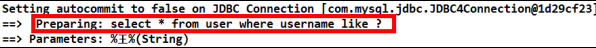
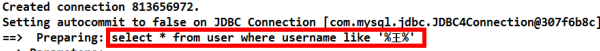

# MyBatis入门 (一)
## MyBatis 框架概述
- mybatis 是一个优秀的基于 java 的持久层框架，它内部封装了 jdbc，使开发者只需要关注 sql 语句本身，而不需要花费精力去处理加载驱动、创建连接、创建 statement 等繁杂的过程。
- mybatis 通过 xml 或注解的方式将要执行的各种 statement 配置起来，并通过 java 对象和 statement 中sql 的动态参数进行映射生成最终执行的 sql 语句，最后由 mybatis 框架执行 sql 并将结果映射为 java 对象并返回。
- 采用 ORM 思想解决了实体和数据库映射的问题，对 jdbc 进行了封装，屏蔽了 jdbc api 底层访问细节，使我们不用与 jdbc api 打交道，就可以完成对数据库的持久化操作。
- 为了我们能够更好掌握框架运行的内部过程，并且有更好的体验，下面我们将从自定义 Mybatis 框架开始来学习框架。此时我们将会体验框架从无到有的过程体验，也能够很好的综合前面阶段所学的基础。
## JDBC 编程的分析
### jdbc 程序的回顾
- 使用 jdbc 的原始方法（未经封装）实现了查询数据库表记录的操作。
```
public static void main(String[] args) {
    Connection connection = null;
    PreparedStatement preparedStatement = null;
    ResultSet resultSet = null;
    try {
      // 加载数据库驱动
      Class.forName("com.mysql.jdbc.Driver");
      // 通过驱动管理类获取数据库链接
      connection =
          DriverManager.getConnection(
              "jdbc:mysql://localhost:3306/mybatis?characterEncoding=utf-8", "ro ot", "root");
      // 定义 sql 语句 ?表示占位符
      String sql = "select * from user where username = ?";
      // 获取预处理 statement
      preparedStatement = connection.prepareStatement(sql);
      // 设置参数，第一个参数为 sql 语句中参数的序号（从 1 开始），第二个参数为设置的参数值
      preparedStatement.setString(1, "王五");
      // 向数据库发出 sql 执行查询，查询出结果集
      resultSet = preparedStatement.executeQuery();
      // 遍历查询结果集
      while (resultSet.next()) {
        System.out.println(resultSet.getString("id") + " " + resultSet.getString("username"));
      }
    } catch (Exception e) {
      e.printStackTrace();
    } finally {
      // 释放资源
      if (resultSet != null) {
        try {
          resultSet.close();
        } catch (SQLException e) {
          e.printStackTrace();
        }
      }
      if (preparedStatement != null) {
        try {
          preparedStatement.close();
        } catch (SQLException e) {
          e.printStackTrace();
        }
      }
      if (connection != null) {
        try {
          connection.close();
        } catch (SQLException e) {
          // TODO Auto-generated catch block
          e.printStackTrace();
        }
      }
    }
  }
```
### jdbc 问题分析
- 1、数据库链接创建、释放频繁造成系统资源浪费从而影响系统性能，如果使用数据库链接池可解决此问题。
- 2、Sql 语句在代码中硬编码，造成代码不易维护，实际应用 sql 变化的可能较大，sql 变动需要改变 java代码。
- 3、使用 preparedStatement 向占有位符号传参数存在硬编码，因为 sql 语句的 where 条件不一定，可能多也可能少，修改 sql 还要修改代码，系统不易维护。
- 4、对结果集解析存在硬编码（查询列名），sql 变化导致解析代码变化，系统不易维护，如果能将数据库记录封装成 pojo 对象解析比较方便。
# Mybatis 框架快速入门
## 添加 Mybatis 的坐标
- pom.xml
```
<dependencies>
        <dependency>
            <groupId>org.mybatis</groupId>
            <artifactId>mybatis</artifactId>
            <version>RELEASE</version>
        </dependency>
        <dependency>
            <groupId>junit</groupId>
            <artifactId>junit</artifactId>
            <version>RELEASE</version>
            <scope>test</scope>
        </dependency>
        <dependency>
            <groupId>mysql</groupId>
            <artifactId>mysql-connector-java</artifactId>
            <version>RELEASE</version>
            <scope>runtime</scope>
        </dependency>
    </dependencies>
```
## 编写 User 实体类
```
public class User implements Serializable {
  private Integer id;
  private String username;
  private Date birthday;
  private String sex;
  private String address;
  // get set 
}
```
## 编写持久层接口 IUserDao
```
public interface IUserDao {

  /**
   * 查询所有用户
   *
   * @return
   */
  List<User> findAll();
}
```
## 编写持久层接口的映射文件 IUserDao.xml
```
<?xml version="1.0" encoding="UTF-8"?>
<!DOCTYPE mapper
        PUBLIC "-//mybatis.org//DTD Mapper 3.0//EN"
        "http://mybatis.org/dtd/mybatis-3-mapper.dtd">
<mapper namespace="cn.andyoung.dao.IUserDao">
    <!-- 配置查询所有操作 -->
    <select id="findAll" resultType="cn.andyoung.domain.User">
select * from user
</select>
</mapper>
```
## 编写 SqlMapConfig.xml 配置文件
```
<?xml version="1.0" encoding="UTF-8"?>
<!DOCTYPE configuration
        PUBLIC "-//mybatis.org//DTD Config 3.0//EN"
        "http://mybatis.org/dtd/mybatis-3-config.dtd">
<configuration>
    <!-- 配置 mybatis 的环境 -->
    <environments default="mysql">
        <!-- 配置 mysql 的环境 -->
        <environment id="mysql">
            <!-- 配置事务的类型 -->
            <transactionManager type="JDBC"></transactionManager>
            <!-- 配置连接数据库的信息：用的是数据源(连接池) -->
            <dataSource type="POOLED">
                <property name="driver" value="com.mysql.jdbc.Driver"/>
                <property name="url" value="jdbc:mysql://localhost:3306/test?serverTimezone=UTC"/>
                <property name="username" value="root"/>
                <property name="password" value="123456"/>
            </dataSource>
        </environment>
    </environments>
    <!-- 告知 mybatis 映射配置的位置 -->
    <mappers>
        <mapper resource="IUserDao.xml"/>
    </mappers>
</configuration>
```
## 编写测试类
```
  @Test
  void testFindAll() throws Exception {
    System.out.println("testFindAll!");
    // 1.读取配置文件
    InputStream in = Resources.getResourceAsStream("SqlMapConfig.xml");
    // 2.创建 SqlSessionFactory 的构建者对象
    SqlSessionFactoryBuilder builder = new SqlSessionFactoryBuilder();
    // 3.使用构建者创建工厂对象 SqlSessionFactory
    SqlSessionFactory factory = builder.build(in);
    // 4.使用 SqlSessionFactory 生产 SqlSession 对象
    SqlSession session = factory.openSession();
    // 5.使用 SqlSession 创建 dao 接口的代理对象
    IUserDao userDao = session.getMapper(IUserDao.class);
    // 6.使用代理对象执行查询所有方法
    List<User> users = userDao.findAll();
    for (User user : users) {
      System.out.println(user);
    }
    // 7.释放资源
    session.close();
    in.close();
  }
```
## 根据ID查询
### 在持久层接口中添加 findById 方法
```
/**
   * 根据 id 查询
   *
   * @param userId
   * @return
   */
  User findById(Integer userId);
```
### 在用户的映射配置文件中配置
- xml
```
<select id="findById" resultType="cn.andyoung.domain.User" parameterType="int">
      select * from user where id = #{uid}
    </select>
```
- 细节：
  - resultType 属性：
用于指定结果集的类型。
  - parameterType 属性：
用于指定传入参数的类型。
- sql 语句中使用#{}字符： 它代表占位符，相当于原来 jdbc 部分所学的?，都是用于执行语句时替换实际的数据。
具体的数据是由#{}里面的内容决定的。
- #{}中内容的写法：
由于数据类型是基本类型，所以此处可以随意写。
### 在测试类添加测试
```
@Test
  public void findById() {
    System.out.println("findById!");
    User user = userDao.findById(1);
    System.out.println(user);
  }
```
## 保存操作
### 在持久层接口中添加新增方法
```
 /**
   * 保存用户
   *
   * @param user
   * @return 影响数据库记录的行数
   */
  int saveUser(User user);
```
### 在用户的映射配置文件中配置
```
<!-- 保存用户-->
    <insert id="saveUser" parameterType="cn.andyoung.domain.User">
        <!-- 配置保存时获取插入的 id -->
        <selectKey keyColumn="id" keyProperty="id" resultType="int">
            select last_insert_id();
        </selectKey>
        insert into user(username,birthday,sex,address)
        values(#{username},#{birthday},#{sex},#{address})
    </insert>
```
- 细节：
  - parameterType 属性：
代表参数的类型，因为我们要传入的是一个类的对象，所以类型就写类的全名称。
  - sql 语句中使用#{}字符： 它代表占位符，相当于原来 jdbc 部分所学的?，都是用于执行语句时替换实际的数据。具体的数据是由#{}里面的内容决定的。
  - #{}中内容的写法：
由于我们保存方法的参数是 一个 User 对象，此处要写 User 对象中的属性名称。它用的是 ognl 表达式。
    - ognl 表达式：
它是 apache 提供的一种表达式语言，全称是：
Object Graphic Navigation Language 对象图导航语言
它是按照一定的语法格式来获取数据的。语法格式就是使用 #{对象.对象}的方式
    - #{user.username}它会先去找 user 对象，然后在 user 对象中找到 username 属性，并调用getUsername()方法把值取出来。但是我们在 parameterType 属性上指定了实体类名称，所以可以省略 `user.` 而直接写 `username`。
### 添加测试类中的测试方法
```
@Test
  public void testSave() {
    User user = new User();
    user.setUsername("modify user name");
    user.setAddress("nb");
    user.setSex("男");
    user.setBirthday(new Date());

    System.out.println("保存操作之前：" + user);
    userDao.saveUser(user);
    System.out.println("保存操作之后：" + user);
  }
```
## 用户更新
### 在持久层接口中添加更新方法
```
 /**
   * 更新用户
   *
   * @param user
   * @return 影响数据库记录的行数
   */
  int updateUser(User user);
```
### 在用户的映射配置文件中配置
```
    <!-- 更新用户 -->
    <update id="updateUser" parameterType="cn.andyoung.domain.User">
        update user set username=#{username},birthday=#{birthday},sex=#{sex},
          address=#{address} where id=#{id}
    </update>
```
### 加入更新的测试方法
```
@Test
  public void testUpdateUser() throws Exception {
    // 1.根据 id 查询
    User user = userDao.findById(1);
    System.out.println("Update操作之前：" + user);
    // 2.更新操作
    user.setAddress("北京市132");
    int res = userDao.updateUser(user);
    System.out.println("Update操作之后：" + user);
    System.out.println(res);
  }
```
## 用户删除
### 在持久层接口中添加删除方法
```
/**
   * 根据 id 删除用户
   *
   * @param userId
   * @return
   */
  int deleteUser(Integer userId);
```
### 在用户的映射配置文件中配置
```
<!-- 删除用户 -->
    <delete id="deleteUser" parameterType="java.lang.Integer">
        delete from user where id = #{uid}
    </delete>
```
### 加入删除的测试方法
```
@Test
  public void testDeleteUser() throws Exception {

    User user = new User();
    user.setUsername("modify user name");
    user.setAddress("nb");
    user.setSex("男");
    user.setBirthday(new Date());

    System.out.println("保存操作之前：" + user);
    userDao.saveUser(user);
    System.out.println("保存操作之后：" + user);
    // 6.执行操作
    //    userDao.saveUser();
    int res = userDao.deleteUser(user.getId());
    System.out.println(res);
  }
```
### 用户模糊查询
### 在持久层接口中添加模糊查询方法
```
/**
   * 根据名称模糊查询
   *
   * @param username
   * @return
   */
  List<User> findByName(String username);
```
### 在用户的映射配置文件中配置
```
<!-- 根据名称模糊查询 -->
    <select id="findByName" resultType="cn.andyoung.domain.User" parameterType="String">
      select * from user where username like #{username}
    </select>
```
### 加入模糊查询的测试方法
```
@Test
  public void testFindByName() {

    // 5.执行查询一个方法
    List<User> users = userDao.findByName("%王%");
    for (User user : users) {
      System.out.println(user);
    }
  }
```
- 在控制台输出的执行 SQL 语句如下：

- 我们在配置文件中没有加入%来作为模糊查询的条件，所以在传入字符串实参时，就需要给定模糊查询的标识%。配置文件中的#{username}也只是一个占位符，所以 SQL 语句显示为“？”。
### 模糊查询的另一种配置方式
第一步：修改 SQL 语句的配置，配置如下：
```
<!-- 根据名称模糊查询 --> 
<select id="findByName" parameterType="string" resultType="com.itheima.domain.User">
    select * from user where username like '%${value}%'
</select>
```
- 我们在上面将原来的#{}占位符，改成了${value}。注意如果用模糊查询的这种写法，那么${value}的写
法就是固定的，不能写成其它名字。
第二步：测试，如下：
```
@Test
  public void testFindByName() {

    // 5.执行查询一个方法
    List<User> users = userDao.findByName("王");
    for (User user : users) {
      System.out.println(user);
    }
  }
```

> 可以发现，我们在程序代码中就不需要加入模糊查询的匹配符%了，这两种方式的实现效果是一样的，但执行的语句是不一样的。
### `#{}`与`${}`的区别
- `#{}`表示一个占位符号
通过`#{}`可以实现 `preparedStatement` 向占位符中设置值，自动进行 java 类型和 jdbc 类型转换，`#{}`可以有效防止 sql 注入。 `#{}`可以接收简单类型值或 `pojo` 属性值。 如果 `parameterType` 传输单个简单类型值，`#{}`括号中可以是 `value` 或其它名称。
- `${}`表示拼接 sql 串
通过`${}`可以将 `parameterType` 传入的内容拼接在 sql 中且不进行 jdbc 类型转换， `${}`可以接收简
单类型值或 `pojo` 属性值，如果 `parameterType` 传输单个简单类型值，`${}`括号中只能是 `value`。
## 模糊查询的${value}源码分析
- 我们一起来看 TextSqlNode 类的源码：

- 这就说明了源码中指定了读取的 key 的名字就是”value”，所以我们在绑定参数时就只能叫 value 的名字
了。
## 查询使用聚合函数
### 在持久层接口中添加模糊查询方法
```
/**
   * 查询总记录条数
   *
   * @return
   */
  int findTotal();
```
### 在用户的映射配置文件中配置
```
<!-- 查询总记录条数 -->
    <select id="findTotal" resultType="int">
      select count(*) from user;
    </select>
```
### 加入聚合查询的测试方法
```
@Test
  public void testFindTotal() {
    // 6.执行操作
    int res = userDao.findTotal();
    System.out.println(res);
  }
```
## Mybatis 与 JDBC 编程的比较
1.数据库链接创建、释放频繁造成系统资源浪费从而影响系统性能，如果使用数据库链接池可解决此问题。
解决：
在 SqlMapConfig.xml 中配置数据链接池，使用连接池管理数据库链接。
2.Sql 语句写在代码中造成代码不易维护，实际应用 sql 变化的可能较大，sql 变动需要改变 java 代码。
解决：
将 Sql 语句配置在 XXXXmapper.xml 文件中与 java 代码分离。
3.向 sql 语句传参数麻烦，因为 sql 语句的 where 条件不一定，可能多也可能少，占位符需要和参数对应。
解决：
Mybatis 自动将 java 对象映射至 sql 语句，通过 statement 中的 parameterType 定义输入参数的
类型。
4.对结果集解析麻烦，sql 变化导致解析代码变化，且解析前需要遍历，如果能将数据库记录封装成 pojo 对
象解析比较方便。
解决：
Mybatis 自动将 sql 执行结果映射至 java 对象，通过 statement 中的 resultType 定义输出结果的
类型。
