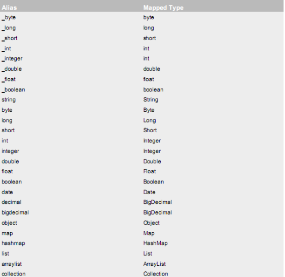
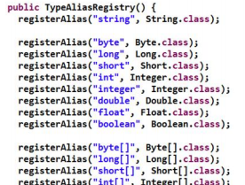

# Mybatis 的参数配置
## parameterType 配置参数
### 使用说明
我们在上一章节中已经介绍了 SQL 语句传参，使用标签的 parameterType 属性来设定。该属性的取值可以是基本类型，引用类型（例如:String 类型），还可以是实体类类型（POJO 类）。同时也可以使用实体类的包装类，本章节将介绍如何使用实体类的包装类作为参数传递。
### 注意事项
- 基 本 类 型 和 String 我 们 可 以 直 接 写 类 型 名 称 ， 也 可 以 使 用 包 名 . 类 名 的 方 式 ， 例 如 ：java.lang.String。
- 实体类类型，目前我们只能使用全限定类名。
- 究其原因，是 mybaits 在加载时已经把常用的数据类型注册了别名，从而我们在使用时可以不写包名，而我们的是实体类并没有注册别名，所以必须写全限定类名。在今天课程的最后一个章节中将讲解如何注册实体类的别名。
在 mybatis 的官方文档的说明(第 19 页)

- 这些都是支持的默认别名。我们也可以从源码角度来看它们分别都是如何定义出来的。
可以参考 TypeAliasRegistery.class 的源码。

## 传递 pojo 包装对象
- 开发中通过 pojo 传递查询条件 ，查询条件是综合的查询条件，不仅包括用户查询条件还包括其它的查询条件（比如将用户购买商品信息也作为查询条件），这时可以使用包装对象传递输入参数。
- Pojo 类中包含 pojo。
需求：根据用户名查询用户信息，查询条件放到 QueryVo 的 user 属性中。
### 编写 QueryVo
```
public class QueryVo {
  private User user;

  public User getUser() {
    return user;
  }

  public void setUser(User user) {
    this.user = user;
  }
}
```
### 编写持久层接口
```
/**
   * 根据 QueryVo 中的条件查询用户
   *
   * @param vo
   * @return
   */
  List<User> findByVo(QueryVo vo);
```
### 持久层接口的映射文件
```
 <!-- 根据用户名称模糊查询，参数变成一个 QueryVo 对象了 -->
    <select id="findByVo" resultType="cn.andyoung.domain.User" parameterType="cn.andyoung.domain.QueryVo">
        select * from user where username like #{user.username};
    </select>
```
### 测试包装类作为参数
```
@Test
  public void testFindByQueryVo() {
    QueryVo vo = new QueryVo();
    User user = new User();
    user.setUsername("%u%");
    vo.setUser(user);
    List<User> users = userDao.findByVo(vo);
    for (User u : users) {
      System.out.println(u);
    }
  }
```
## resultType 配置结果类型
- resultType 属性可以指定结果集的类型，它支持基本类型和实体类类型。
我们在前面的 CRUD 案例中已经对此属性进行过应用了。
- 需要注意的是，它和 parameterType 一样，如果注册过类型别名的，可以直接使用别名。没有注册过的必须
- 使用全限定类名。例如：我们的实体类此时必须是全限定类名（今天最后一个章节会讲解如何配置实体类的别名）
- 同时，当是实体类名称是，还有一个要求，实体类中的属性名称必须和查询语句中的列名保持一致，否则无法实现封装。
### 基本类型示例
#### Dao 接口
```
/**
   * 查询总记录条数
   *
   * @return
   */
  int findTotal();
```
#### 映射配置
```
<!-- 查询总记录条数 -->
    <select id="findTotal" resultType="int">
      select count(*) from user;
    </select>
```
### 实体类类型示例
#### Dao 接口
```
/**
   * 查询所有用户
   *
   * @return
   */
  List<User> findAll();
```
#### 映射配置
```
<!-- 配置查询所有操作 -->
    <select id="findAll" resultType="cn.andyoung.domain.User">
      select * from user
    </select>
```
### 特殊情况示例
#### 修改实体类
- 实体类代码如下：(此时的实体类属性和数据库表的列名已经不一致了)
```
public class User1 {

  private Integer userId;
  private String userName;
  private Date userBirthday;
  private String userSex;
  private String userAddress;
 //get/set
}
```
#### 修改映射配置
- 使用别名查询
```
<select id="findAllT" resultType="cn.andyoung.domain.User1">
      select id as userId,username as userName,birthday as userBirthday,sex as userSex,address as userAddress from user
    </select>
```
-思考：
如果我们的查询很多，都使用别名的话写起来岂不是很麻烦，有没有别的解决办法呢？请看下一小节。
## resultMap 结果类型
> resultMap 标签可以建立查询的列名和实体类的属性名称不一致时建立对应关系。从而实现封装。
在 select 标签中使用 resultMap 属性指定引用即可。同时 resultMap 可以实现将查询结果映射为复杂类型的 pojo，比如在查询结果映射对象中包括 pojo 和 list 实现一对一查询和一对多查询。
### 定义 resultMap
```
<!-- 建立 User 实体和数据库表的对应关系
    type 属性：指定实体类的全限定类名
    id 属性：给定一个唯一标识，是给查询 select 标签引用用的。
    -->
<resultMap type="cn.andyoung.domain.User" id="userMap">
        <id column="id" property="userId"/>
        <result column="username" property="userName"/>
        <result column="sex" property="userSex"/>
        <result column="address" property="userAddress"/>
        <result column="birthday" property="userBirthday"/>
    </resultMap>
```
- id 标签：用于指定主键字段
- result 标签：用于指定非主键字段
- column 属性：用于指定数据库列名
- property 属性：用于指定实体类属性名称
## Mybatis 实现 DAO 的传统开发方式
> 使用 Mybatis 开发 Dao，通常有两个方法，即原始 Dao 开发方式和 Mapper 接口代理开发方式。而现在主流的开发方式是接口代理开发方式，这种方式总体上更加简便。我们的课程讲解也主要以接口代理开发方式为主。在上面一节已经给大家介绍了基于代理方式的 dao 开发，现在给大家介绍一下基于传统编写 Dao 实现类的开发方式。
### 持久层 Dao 实现类
```
public class UserDaoImpl implements IUserDao {

  private SqlSessionFactory factory;

  public UserDaoImpl(SqlSessionFactory factory) {
    this.factory = factory;
  }

  @Override
  public List<User> findAll() {
    SqlSession session = factory.openSession();
    List<User> users = session.selectList("cn.andyoung.dao.IUserDao.findAll");
    session.close();
    return users;
  }

  @Override
  public User findById(Integer userId) {
    SqlSession session = factory.openSession();
    User user = session.selectOne("cn.andyoung.dao.IUserDao.findById", userId);
    session.close();
    return user;
  }

  @Override
  public int saveUser(User user) {
    SqlSession session = factory.openSession();
    int res = session.insert("cn.andyoung.dao.IUserDao.saveUser", user);
    session.commit();
    session.close();
    return res;
  }

  @Override
  public int updateUser(User user) {
    SqlSession session = factory.openSession();
    int res = session.update("cn.andyoung.dao.IUserDao.updateUser", user);
    session.commit();
    session.close();
    return res;
  }

  @Override
  public int deleteUser(Integer userId) {
    SqlSession session = factory.openSession();
    int res = session.delete("cn.andyoung.dao.IUserDao.deleteUser", userId);
    session.commit();
    session.close();
    return res;
  }

  @Override
  public int findTotal() {
    SqlSession session = factory.openSession();
    int res = session.selectOne("cn.andyoung.dao.IUserDao.findTotal");
    session.close();
    return res;
  }
}
```
# SqlMapConfig.xml配置文件
## 配置内容
### SqlMapConfig.xml 中配置的内容和顺序
- properties（属性）
  - property
- settings（全局配置参数）
  - setting
- typeAliases（类型别名）
  - typeAliase
- package
- typeHandlers（类型处理器）
- objectFactory（对象工厂）
- plugins（插件）
- environments（环境集合属性对象）
  - environment（环境子属性对象）
    - transactionManager（事务管理）
     - dataSource（数据源）
- mappers（映射器）
  - mapper
  - package
## properties（属性）
> 在使用 properties 标签配置时，我们可以采用两种方式指定属性配置。
### 第一种
```
 <properties>
        <property name="jdbc.driver" value="com.mysql.jdbc.Driver"/>
        <property name="jdbc.url" value="jdbc:mysql://localhost:3306/test"/>
        <property name="jdbc.username" value="root"/>
        <property name="jdbc.password" value="1234"/>
    </properties>
```
#### 在 classpath 下定义 db.properties 文件
```
jdbc.driver=com.mysql.jdbc.Driver
jdbc.url=jdbc:mysql://localhost:3306/eesy
jdbc.username=root
jdbc.password=1234
```
#### properties 标签配置
```
    <!-- 配置连接数据库的信息
resource 属性：用于指定 properties 配置文件的位置，要求配置文件必须在类路径下
resource="jdbcConfig.properties"
url 属性：
URL： Uniform Resource Locator 统一资源定位符
http://localhost:8080/mystroe/CategoryServlet URL
协议 主机 端口 URI
URI：Uniform Resource Identifier 统一资源标识符
/mystroe/CategoryServlet
它是可以在 web 应用中唯一定位一个资源的路径
-->
    <properties url="PATH/jdbcConfig.properties"></properties>
```
### 此时我们的 dataSource 标签就变成了引用上面的配置
```
<dataSource type="POOLED"> <property name="driver" value="${jdbc.driver}"/>
        <property name="url" value="${jdbc.url}"/>
        <property name="username" value="${jdbc.username}"/>
        <property name="password" value="${jdbc.password}"/>
    </dataSource>
```
## typeAliases（类型别名）
> 在前面我们讲的 Mybatis 支持的默认别名，我们也可以采用自定义别名方式来开发。
### 自定义别名：
- 在 SqlMapConfig.xml 中配置：
```
<typeAliases>
        <!-- 单个别名定义 --> 
        <typeAlias alias="user" type="cn.andyoung.domain.User"/>
        <!-- 批量别名定义，扫描整个包下的类，别名为类名（首字母大写或小写都可以） --> <package name="com.itheima.domain"/>
        <package name="其它包"/>
    </typeAliases>
```
## mappers（映射器）
### <mapper resource=" " />
> 使用相对于类路径的资源
```
<!-- 告知 mybatis 映射配置的位置 -->
    <mappers>
        <mapper resource="IUserDao.xml"/>
    </mappers>
```
### <mapper class=" " />
```
使用 mapper 接口类路径
如：<mapper class="cn.andyoung.dao.UserDao"/>
注意：此种方法要求 mapper 接口名称和 mapper 映射文件名称相同，且放在同一个目录中。
```
### <package name=""/>
> 注册指定包下的所有 mapper 接口
如：`<package name="cn.andyoung.mybatis.mapper"/>`
注意：此种方法要求 mapper 接口名称和 mapper 映射文件名称相同，且放在同一个目录中。
## Mybatis 的连接池技术
我们在前面的 WEB 也学习过类似的连接池技术，而在 Mybatis 中也有连接池技术，但是它采用的是自
己的连接池技术。在 Mybatis 的 SqlMapConfig.xml 配置文件中，通过`<dataSource type=”pooled”>`来实现 Mybatis 中连接池的配置。
> 我们的数据源配置就是在 SqlMapConfig.xml 文件中，具体配置如下：
```
<!-- 配置数据源（连接池）信息 -->
<dataSource type="POOLED"> 
  <property name="driver" value="${jdbc.driver}"/>
  <property name="url" value="${jdbc.url}"/>
  <property name="username" value="${jdbc.username}"/>
  <property name="password" value="${jdbc.password}"/>
</dataSource>
```
MyBatis 在初始化时，根据`<dataSource>`的 type 属性来创建相应类型的的数据源 DataSource，即：
- type=”POOLED”：MyBatis 会创建 PooledDataSource 实例
- type=”UNPOOLED” ： MyBatis 会创建 UnpooledDataSource 实例
- type=”JNDI”：MyBatis 会从 JNDI 服务上查找 DataSource 实例，然后返回使用
> 在这三种数据源中，我们一般采用的是 POOLED 数据源（很多时候我们所说的数据源就是为了更好的管理数据
库连接，也就是我们所说的连接池技术）。
## Mybatis 的事务控制
在 JDBC 中我们可以通过手动方式将事务的提交改为手动方式，通过 setAutoCommit()方法就可以调整。
那么我们的 Mybatis 框架因为是对 JDBC 的封装，所以 Mybatis 框架的事务控制方式，本身也是用 JDBC 的setAutoCommit()方法来设置事务提交方式的。Mybatis 中事务的提交方式，本质上就是调用 JDBC 的 setAutoCommit()来实现事务控制。
通过上面的研究和分析，现在我们一起思考，为什么 CUD 过程中必须使用 sqlSession.commit()提交事
务？主要原因就是在连接池中取出的连接，都会将调用 connection.setAutoCommit(false)方法，这样我们
就必须使用 sqlSession.commit()方法，相当于使用了 JDBC 中的 connection.commit()方法实现事务提
交。
明白这一点后，我们现在一起尝试不进行手动提交，一样实现 CUD 操作。
```
@Before//在测试方法执行之前执行
public void init()throws Exception {
    //1.读取配置文件
    in = Resources.getResourceAsStream("SqlMapConfig.xml");
    //2.创建构建者对象
    SqlSessionFactoryBuilder builder = new SqlSessionFactoryBuilder();
    //3.创建 SqlSession 工厂对象
    factory = builder.build(in);
    //4.创建 SqlSession 对象 打开自动提交
    session = factory.openSession(true);
    //5.创建 Dao 的代理对象
    userDao = session.getMapper(IUserDao.class);
}
```