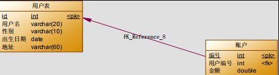
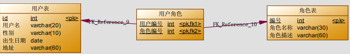

# Mybatis 多表查询
## Mybatis 多表查询之一对多

- 本次案例主要以最为简单的用户和账户的模型来分析 Mybatis 多表关系。用户为 User 表，账户为Account
表。一个用户（User）可以有多个账户（Account）。具体关系如下：

## 一对一查询(多对一)
- 需求
查询所有账户信息，关联查询下单用户信息。
- 注意：
因为一个账户信息只能供某个用户使用，所以从查询账户信息出发关联查询用户信息为一对一查询。如果从用户信息出发查询用户下的账户信息则为一对多查询，因为一个用户可以有多个账户。
### 方式一
#### 定义账户信息的实体类
```
public class Account implements Serializable {
  private Integer id;
  private Integer uid;
  private Double money;
  // get set
}
```
#### 定义 AccountUser 类
为了能够封装上面 SQL 语句的查询结果，定义 AccountCustomer 类中要包含账户信息同时还要包含用户信息，所以我们要在定义 AccountUser 类时可以继承 User 类。
```
public class AccountUser extends Account implements Serializable {
  private String username;
  private String address;
  //get set
}
```
#### 定义账户的持久层 Dao 接口
```
/**
* 查询所有账户，同时获取账户的所属用户名称以及它的地址信息
* @return
*/
List<AccountUser> findAll();
```
#### 定义 AccountDao.xml 文件中的查询配置信息
```
<?xml version="1.0" encoding="UTF-8"?>
<!DOCTYPE mapper 
PUBLIC "-//mybatis.org//DTD Mapper 3.0//EN" 
"http://mybatis.org/dtd/mybatis-3-mapper.dtd"> <mapper namespace="com.itheima.dao.IAccountDao">
<!-- 配置查询所有操作--> 
    <select id="findAll" resultType="accountuser">
        select a.*,u.username,u.address from account a,user u where a.uid =u.id;
    </select> 
```
注意：因为上面查询的结果中包含了账户信息同时还包含了用户信息，所以我们的返回值类型 returnType
的值设置为 AccountUser 类型，这样就可以接收账户信息和用户信息了。
#### 小结：
> 定义专门的 po 类作为输出类型，其中定义了 sql 查询结果集所有的字段。此方法较为简单，企业中使用普遍。
### 方式二
使用 resultMap，定义专门的 resultMap 用于映射一对一查询结果。
通过面向对象的(has a)关系可以得知，我们可以在 Account 类中加入一个 User 类的对象来代表这个账户是哪个用户的。
#### 修改 Account 类
在 Account 类中加入 User 类的对象作为 Account 类的一个属性。
```
public class Account implements Serializable {
  private Integer id;
  private Integer uid;
  private Double money;

  private User user;
  // get set
}
```
#### 修改 AccountDao 接口中的方法
```
public interface IAccountDao {

  /**
   * 查询所有账户，同时获取账户的所属用户名称以及它的地址信息
   *
   * @return
   */
  List<Account> findAll();
}
```
> 注意：第二种方式，将返回值改 为了 Account 类型。
因为 Account 类中包含了一个 User 类的对象，它可以封装账户所对应的用户信息
#### 重新定义 AccountDao.xml 文件
```
<?xml version="1.0" encoding="UTF-8"?>
<!DOCTYPE mapper
        PUBLIC "-//mybatis.org//DTD Mapper 3.0//EN"
        "http://mybatis.org/dtd/mybatis-3-mapper.dtd">
<mapper namespace="cn.andyoung.dao.IAccountDao">
    <!-- 建立对应关系 -->
    <resultMap type="account" id="accountMap">
        <id column="aid" property="id"/>
        <result column="uid" property="uid"/>
        <result column="money" property="money"/>
        <!-- 它是用于指定从表方的引用实体属性的 -->
        <association property="user" javaType="user">
            <id column="id" property="id"/>
            <result column="username" property="username"/>
            <result column="sex" property="sex"/>
            <result column="birthday" property="birthday"/>
            <result column="address" property="address"/>
        </association>
    </resultMap>
    <select id="findAll" resultMap="accountMap">
        select u.*,a.id as aid,a.uid,a.money from account a,user u where a.uid =u.id;
    </select>
</mapper>
```
#### 在 AccountTest 类中加入测试方法
```
@Test
  public void testFindAll() {
    List<Account> accounts = accountDao.findAll();
    for (Account au : accounts) {
      System.out.println(au);
      System.out.println(au.getUser());
    }
  }
```
## 一对多查询
- 需求：
查询所有用户信息及用户关联的账户信息。
- 分析：
用户信息和他的账户信息为一对多关系，并且查询过程中如果用户没有账户信息，此时也要将用户信息查询出来，我们想到了左外连接查询比较合适。
### 编写 SQL 语句
- 建立account账号表
```
CREATE TABLE `account` (
  `id` int(11) NOT NULL AUTO_INCREMENT,
  `uid` int(11) DEFAULT NULL,
  `money` float(10,0) NOT NULL DEFAULT '0',
  PRIMARY KEY (`id`) USING BTREE
) ENGINE=InnoDB AUTO_INCREMENT=2 DEFAULT CHARSET=utf8mb4 COLLATE=utf8mb4_german2_ci;
```
```
SELECT
u.*, acc.id id,
acc.uid,
acc.money
FROM
user u
LEFT JOIN account acc ON u.id = acc.uid
```
### User 类加入 List<Account>
```
public class User implements Serializable {
  private Integer id;
  private String username;
  private Date birthday;
  private String sex;
  private String address;

  private List<Account> accounts;
  // get set
}
```
### 用户持久层 Dao 接口中加入查询方法
```
/**
* 查询所有用户，同时获取出每个用户下的所有账户信息
* @return
*/
List<User> findAll();
```
### 用户持久层 Dao 映射文件配置
```
<resultMap type="user" id="userMap">
        <id column="id" property="id"></id>
        <result column="username" property="username"/>
        <result column="address" property="address"/>
        <result column="sex" property="sex"/>
        <result column="birthday" property="birthday"/>
        <!-- collection 是用于建立一对多中集合属性的对应关系
        ofType 用于指定集合元素的数据类型
        -->
        <collection property="accounts" ofType="account">
            <id column="aid" property="id"/>
            <result column="uid" property="uid"/>
            <result column="money" property="money"/>
        </collection>
    </resultMap>

    <!-- 配置查询所有操作 -->
    <select id="findAll" resultMap="userMap">
      select u.*,a.id as aid ,a.uid,a.money from user u left outer join account a on u.id =a.uid
    </select>
```
- collection
部分定义了用户关联的账户信息。表示关联查询结果集
- property="accList"：
关联查询的结果集存储在 User 对象的上哪个属性。
- ofType="account"：
指定关联查询的结果集中的对象类型即List中的对象类型。此处可以使用别名，也可以使用全限定名。
### 测试方法
# Mybatis 多表查询之多对多
通过前面的学习，我们使用 Mybatis 实现一对多关系的维护。多对多关系其实我们看成是双向的一对多关系。
### 用户与角色的关系模型
用户与角色的多对多关系模型如下：

在 MySQL 数据库中添加角色表，用户角色的中间表。
角色表
```
CREATE TABLE `role` (
  `id` int(10) unsigned NOT NULL AUTO_INCREMENT,
  `role_name` varchar(45) COLLATE utf8mb4_german2_ci DEFAULT NULL,
  `role_desc` varchar(45) COLLATE utf8mb4_german2_ci DEFAULT NULL,
  PRIMARY KEY (`id`)
) ENGINE=InnoDB DEFAULT CHARSET=utf8mb4 COLLATE=utf8mb4_german2_ci;
```
用户角色中间表
```
CREATE TABLE `user_role` (
  `uid` int(10) unsigned DEFAULT NULL,
  `rid` int(10) unsigned DEFAULT NULL
) ENGINE=InnoDB DEFAULT CHARSET=utf8mb4 COLLATE=utf8mb4_german2_ci;
```
### 业务要求及实现 SQL
- 需求：
实现查询所有对象并且加载它所分配的用户信息。
- 分析：
查询角色我们需要用到Role表，但角色分配的用户的信息我们并不能直接找到用户信息，而是要通过中间表(USER_ROLE 表)才能关联到用户信息。
下面是实现的 SQL 语句：
```
SELECT
r.*,u.id uid,
u.username username,
u.birthday birthday,
u.sex sex,
u.address address
FROM 
ROLE r
INNER JOIN 
USER_ROLE ur
ON ( r.id = ur.rid)
INNER JOIN
USER u
ON (ur.uid = u.id);
```
### 编写角色实体类
```
public class Role {
  private Integer roleId;
  private String roleName;
  // get set
}
```
### 编写 Role 持久层接口
```
public interface IRoleDao {
  /**
   * 查询所有角色
   *
   * @return
   */
  List<Role> findAll();
}
```
### 编写映射文件
```
<?xml version="1.0" encoding="UTF-8"?>
<!DOCTYPE mapper
        PUBLIC "-//mybatis.org//DTD Mapper 3.0//EN"
        "http://mybatis.org/dtd/mybatis-3-mapper.dtd">
<mapper namespace="cn.andyoung.dao.IRoleDao">
    <!--定义 role 表的 ResultMap-->
    <resultMap id="roleMap" type="role">
        <id property="roleId" column="rid"></id>
        <result property="roleName" column="role_name"></result>
        <result property="roleDesc" column="role_desc"></result>
        <collection property="users" ofType="user">
            <id column="id" property="id"></id>
            <result column="username" property="username"></result>
            <result column="address" property="address"></result>
            <result column="sex" property="sex"></result>
            <result column="birthday" property="birthday"></result>
        </collection>
    </resultMap>
    <!--查询所有-->
    <select id="findAll" resultMap="roleMap">
      select u.*,r.id as rid,r.role_name,r.role_desc from role r left outer join user_role ur on r.id = ur.rid left outer join user u on u.id = ur.uid
    </select>
</mapper>
```
### 编写测试类
```
/** 测试查询所有 */
  @Test
  public void testFindAll() {
    List<Role> roles = roleDao.findAll();
    for (Role role : roles) {
      System.out.println("---每个角色的信息----");
      System.out.println(role);
      System.out.println(role.getUsers());
    }
  }
```