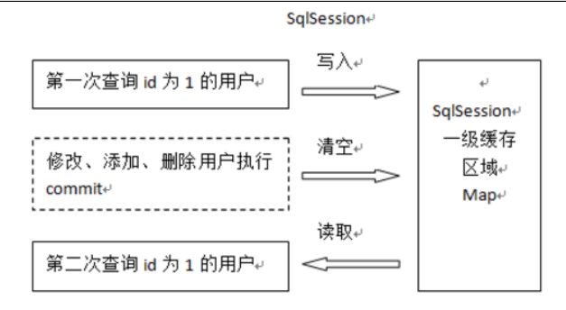
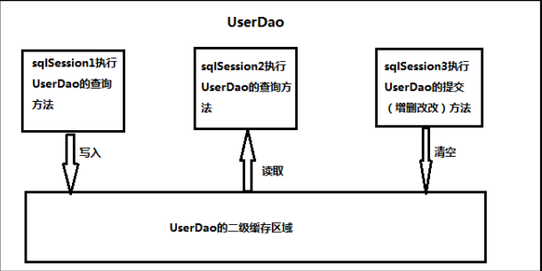

# Mybatis延迟加载策略
通过前面的学习，我们已经掌握了 Mybatis 中一对一，一对多，多对多关系的配置及实现，可以实现对象的关联查询。实际开发过程中很多时候我们并不需要总是在加载用户信息时就一定要加载他的账户信息。此时就是我们所说的延迟加载。
## 何为延迟加载?
- 延迟加载：
就是在需要用到数据时才进行加载，不需要用到数据时就不加载数据。延迟加载也称懒加载.
  - 好处：先从单表查询，需要时再从关联表去关联查询，大大提高数据库性能，因为查询单表要比关联查询多张表速度要快。
  - 坏处：
因为只有当需要用到数据时，才会进行数据库查询，这样在大批量数据查询时，因为查询工作也要消耗时间，所以可能造成用户等待时间变长，造成用户体验下降。
## 实现需求
- 需求：
查询账户(Account)信息并且关联查询用户(User)信息。如果先查询账户(Account)信息即可满足要求，当我们需要查询用户(User)信息时再查询用户(User)信息。把对用户(User)信息的按需去查询就是延迟加载。
mybatis实现多表操作时，我们使用了resultMap来实现一对一，一对多，多对多关系的操作。主要是通过 association、collection 实现一对一及一对多映射。association、collection 具备延迟加载功能。
## 使用 assocation 实现延迟加载
- 需求：
查询账户信息同时查询用户信息。
### 账户的持久层 DAO 接口
```
public interface IAccountDao {

  /**
   * 查询所有账户，同时获取账户的所属用户名称以及它的地址信息
   *
   * @return
   */
  List<Account> findAllAcc();
}
```
### 账户的持久层映射文件
```
<!--使用 assocation 实现延迟加载-->
    <!-- 建立对应关系 -->
    <resultMap type="account" id="accountMap">
        <id column="aid" property="id"/>
        <result column="uid" property="uid"/>
        <result column="money" property="money"/>
        <!-- 它是用于指定从表方的引用实体属性的 -->
        <association property="user" javaType="user"
                     select="cn.andyoung.dao.IUserDao.findById"
                     column="uid">
        </association>
    </resultMap>
    <select id="findAll" resultMap="accountMap">
        select * from account
    </select>
```
- select： 填写我们要调用的 select 映射的 id 
- column ： 填写我们要传递给 select 映射的参数
### 开启 Mybatis 的延迟加载策略
我们需要在 Mybatis 的配置文件 SqlMapConfig.xml 文件中添加延迟加载的配置。
```
<!-- 开启延迟加载的支持 -->
    <settings>
        <setting name="lazyLoadingEnabled" value="true"/>
        <setting name="aggressiveLazyLoading" value="false"/>
    </settings>
```
### 编写测试只查账户信息不查用户信息。
```
@Test
  public void findAllLazy() {
    List<Account> accounts = accountDao.findAllLazy();
    for (Account au : accounts) {
      System.out.println(au);
     // System.out.println(au.getUser());
    }
  }
```
## 使用 Collection 实现延迟加载
同样我们也可以在一对多关系配置的`<collection>`结点中配置延迟加载策略。
`<collection>`结点中也有 select 属性，column 属性。
- 需求：
完成加载用户对象时，查询该用户所拥有的账户信息。
### 编写用户持久层映射配置
```
<resultMap type="user" id="userMapLazyC">
        <id column="id" property="id"></id>
        <result column="username" property="username"/>
        <result column="address" property="address"/>
        <result column="sex" property="sex"/>
        <result column="birthday" property="birthday"/>
        <!-- collection 是用于建立一对多中集合属性的对应关系
        ofType 用于指定集合元素的数据类型
        select 是用于指定查询账户的唯一标识（账户的 dao 全限定类名加上方法名称）
        column 是用于指定使用哪个字段的值作为条件查询
        -->
        <collection property="accounts" ofType="account"
                    select="cn.andyoung.dao.IAccountDao.findByUid"
                    column="id">
        </collection>
    </resultMap>
    <!-- 配置查询所有操作 -->
    <select id="findAll" resultMap="userMapLazyC">
      select * from user
    </select>
```
`<collection>`标签：
主要用于加载关联的集合对象
- select 属性：
用于指定查询 account 列表的 sql 语句，所以填写的是该 sql 映射的 id
- column 属性：
用于指定 select 属性的 sql 语句的参数来源，上面的参数来自于 user 的 id 列，所以就写成 id 这一个字段名了
# Mybatis 缓存
像大多数的持久化框架一样，Mybatis 也提供了缓存策略，通过缓存策略来减少数据库的查询次数，从而提高性能。
Mybatis 中缓存分为一级缓存，二级缓存。

## 一级缓存的分析
一级缓存是 SqlSession 范围的缓存，当调用 SqlSession 的修改，添加，删除，commit()，close()等方法时，就会清空一级缓存。

第一次发起查询用户 id 为 1 的用户信息，先去找缓存中是否有 id 为 1 的用户信息，如果没有，从数据库查询用户信息。
得到用户信息，将用户信息存储到一级缓存中。
如果 sqlSession 去执行 commit 操作（执行插入、更新、删除），清空 SqlSession 中的一级缓存，这样做的目的为了让缓存中存储的是最新的信息，避免脏读。
第二次发起查询用户 id 为 1 的用户信息，先去找缓存中是否有 id 为 1 的用户信息，缓存中有，直接从缓存中获取用户信息。
## Mybatis 二级缓存
二级缓存是 mapper 映射级别的缓存，多个 SqlSession 去操作同一个 Mapper 映射的 sql 语句，多个SqlSession 可以共用二级缓存，二级缓存是跨 SqlSession 的。

- 首先开启 mybatis 的二级缓存。
sqlSession1 去查询用户信息，查询到用户信息会将查询数据存储到二级缓存中。
- 如果 SqlSession3 去执行相同 mapper 映射下 sql，执行 commit 提交，将会清空该 mapper 映射下的二级缓存区域的数据。
- sqlSession2 去查询与 sqlSession1 相同的用户信息，首先会去缓存中找是否存在数据，如果存在直接从缓存中取出数据。
### 在 SqlMapConfig.xml 文件开启二级缓存
```
<settings>
<!-- 开启二级缓存的支持 --> 
    <setting name="cacheEnabled" value="true"/>
</settings>
```
> 因为 cacheEnabled 的取值默认就为 true，所以这一步可以省略不配置。为 true 代表开启二级缓存；为false 代表不开启二级缓存。
### 二级缓存注意事项
当我们在使用二级缓存时，所缓存的类一定要实现 java.io.Serializable 接口，这种就可以使用序列化方式来保存对象。