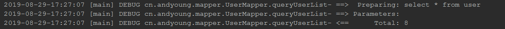

# Mybatis 日志输出
在resources文件下新增日志配置文件`logback-spring.xml`具体配置解析参考[Spring Boot的日志详解](../springboot/SpringBoot的日志详解.md)
```
<?xml version="1.0" encoding="UTF-8"?>
<configuration scan="true" scanPeriod="60 seconds" debug="false">
    <contextName>spring-boot-logging</contextName>
    <property name="logPath" value="log"/>

    <!--输出到控制台-->
    <appender name="console" class="ch.qos.logback.core.ConsoleAppender">
        <filter class="ch.qos.logback.classic.filter.LevelFilter">
            <level>ERROR</level>
        </filter>
        <encoder>
            <pattern>%d{yyyy-MM-dd-HH:mm:ss} [%thread] %-5level %logger- %msg%n</pattern>
        </encoder>
    </appender>

    <!--输出到文件-->
    <appender name="file" class="ch.qos.logback.core.rolling.RollingFileAppender">
        <file>${logPath}/spring-boot-logging.log</file>

        <rollingPolicy class="ch.qos.logback.core.rolling.TimeBasedRollingPolicy">
            <fileNamePattern>${logPath}/spring-boot-logging.%d{yyyy-MM-dd}.log</fileNamePattern>
            <!-- 日志保存周期 -->
            <maxHistory>30</maxHistory>
            <!-- 总大小 -->
            <totalSizeCap>1GB</totalSizeCap>
        </rollingPolicy>
        <encoder>
            <pattern>%d{HH:mm:ss.SSS} [%thread] %-5level %logger{36} - %msg%n</pattern>
        </encoder>
    </appender>

    <root level="info">
        <appender-ref ref="console"/>
        <appender-ref ref="file"/>
    </root>
    <!-- mybatis日志打印-->
    <logger name="org.apache.ibatis" level="DEBUG"/>
    <logger name="java.sql" level="DEBUG"/>

    <!--  项目 mapper 路径
            console控制台显示sql语句：STDOUT.filter.level -> debug级别
    -->
    <logger name="cn.andyoung.mapper" level="DEBUG">
    </logger>
</configuration>
```
## 运行结果

