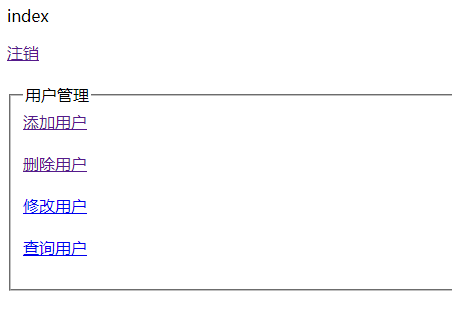

# Spring Security 用户注销 与 Thymeleaf 权限控制
Spring Security 用户注销
1、上一篇[《Spring Security 详细简绍与入门》](./README.md)中内存用户从浏览器访问时已经如下认证与授权：

> zhangWuJi 可以访问 addUser、deleteUser、updateUser、findAllUsers 方法
>
> guoJing 可以访问 deleteUser、updateUser、findAllUsers 方法
>
> yangGuo 可以访问 updateUser、findAllUsers 方法
>
> weiXiaoBao  可以访问 findAllUsers 方法
2、 添加登出配置
```

  @Override
  public void configure(HttpSecurity http) throws Exception {
    /**
     * authorizeRequests：表示验证请求 antMatchers(String... antPatterns)：使用
     * org.springframework.security.web.util.matcher.AntPathRequestMatcher 的匹配规则
     * permitAll()：允许一切用户访问，底层也是调用 access("permitAll") hasRole(String role)：url请求允许访问的角色
     * hasAnyRole(String... roles) : url请求允许访问的多个角色 access(String
     * attribute)：允许访问的角色，permitAll、hasRole、hasAnyRole 底层都是调用 access 方法 access("permitAll") 等价于
     * permitAll()
     */
    http.authorizeRequests().antMatchers("/").permitAll(); // "/"：应用首页所以用户都可以访问
    http.authorizeRequests()
        .antMatchers("/user/addUser")
        .hasRole("topLevel") // 首斜杠"/"表示应用上下文,/user/addUser 请求允许 topLevel 角色访问
        .antMatchers("/user/deleteUser/**")
        .hasAnyRole(
            "topLevel", "senior") // "/user/deleteUser/**"允许 "topLevel", "senior" 角色访问，/**匹配任意
        .antMatchers("/user/updateUser")
        .hasAnyRole("topLevel", "senior", "middleRank") // 除了这种链式编程，也可以分开写
        .antMatchers("/user/findAllUsers")
        .access("permitAll");

    http.authorizeRequests().antMatchers("/home.html").permitAll();
    /**
     * http.authorizeRequests().anyRequest().hasRole("senior")： 表示上面约定以外的所有请求，都需要有 senior 角色才可以访问
     * http.authorizeRequests().anyRequest().authenticated()：
     * 表示上面约定以外的所有请求，必须要经过认证才能访问，但是认证的可以是任意角色，即只要认证就行，与角色的权限无关
     */
    //        http.authorizeRequests().anyRequest().hasRole("senior");
    http.authorizeRequests().anyRequest().authenticated();

    /**
     * formLogin：指定支持基于表单的身份验证 未使用 FormLoginConfigurer#loginPage(String)
     * 指定登录页时，将自动生成一个登录页面，亲测此页面引用的是联网的 bootstarp 的样式，所以断网时，样式会有点怪 当用户没有登录、没有权限时就会自动跳转到登录页面(默认
     * /login) 当登录失败时，默认跳转到 /login?error 登录成功时会放行
     */
    http.formLogin();
    /**
     * logout：开启自动配置注销功能 默认以 "/logout" 路劲表示用户注销，即页面请求 "/logout" 时，就会自动注销登录，同时自动清除 session
     * 注销成功后，默认跳转到 "/login?logout" 登录页面
     */
    /**
     * logout：开启自动配置注销功能 默认以 "/logout" 路劲表示用户注销，即页面请求 "/logout" 时，就会自动注销登录，同时自动清除 session
     * 注销成功后，默认跳转到 "/login?logout" 登录页面 deleteCookies("remove")：注销后删除一个key叫 "remove" 的 cookie
     * invalidateHttpSession(false)：注销后仍然保留 HttpSession（视实际需求而定，通常是要清除的）
     * logoutSuccessUrl("/home.html")：注销后不再进入默认的 "/login?logout" 登录页面,而是进入 /home.html 页面
     */
    http.logout().invalidateHttpSession(true).logoutSuccessUrl("/home.html");
  }
```
3、 index.html 内容修改如下，注销请求地址指向默认的 "/logout"：
```
<!DOCTYPE html>
<html lang="en" xmlns:th="http://www.thymeleaf.org">
<head>
    <meta charset="UTF-8">
    <title>Title</title>
</head>
<body>
<p>index</p>
<a href="#" th:href="@{/logout}">注销</a><br><br>
<fieldset>
    <legend>用户管理</legend>
    <a th:href="@{/user/addUser}">添加用户</a><br><br>
    <a th:href="@{/user/deleteUser/101}">删除用户</a><br><br>
    <a th:href="@{/user/updateUser}">修改用户</a><br><br>
    <a th:href="@{/user/findAllUsers}">查询用户</a><br><br>
</fieldset>
</body>
</html>
```
4、 此时访问效果如下：

> 查询学生方法授权给所有用户都可以访问，所以第一次未登录时也可以访问。
第二次点击修改学生时因为没有用户认证，所以自动跳转到登录页面 /login 进行登录。
登录成功后，因为 zhangWuJi 拥有顶级权限，所以4个方法都可以访问
当点击注销按钮时，自动进入默认的 "/logout" ，点击确定退出后，再次进入登录页面 (/login/logout)，此时会自动清除 session.
## thymeleaf-extras-springsecurity 权限控制
> 1、pom.xml 文件中导入 thymeleaf-extras-springsecurityX 依赖，注意本文版本为：Spring boot2.1.3 + Spring Security5.1.4 + Thymeleaf-extras-springsecurity5。下面将整个文件内容粘贴如下：
```
        <!-- Thymeleaf 模板引擎-->
        <dependency>
            <groupId>org.springframework.boot</groupId>
            <artifactId>spring-boot-starter-thymeleaf</artifactId>
        </dependency>
        <!-- Thymeleaf 整合 Spring Security 组件-->
        <dependency>
            <groupId>org.thymeleaf.extras</groupId>
            <artifactId>thymeleaf-extras-springsecurity5</artifactId>
        </dependency>
```
2、后台代码不用任何修改，只需要 index.html 中使用 thymeleaf 标签即可。
```
<!DOCTYPE html>
<html lang="en" xmlns:th="http://www.thymeleaf.org"
      xmlns:sec="http://www.thymeleaf.org/extras/spring-security">
<head>
    <meta charset="UTF-8">
    <title>Title</title>
</head>
<body>
<p>index</p>
<div sec:authorize="!isAuthenticated()">
    <span style="color: red">温馨提示：使用前请先登录<a th:href="@{/login}">登录</a></span>
</div>

<div sec:authorize="isAuthenticated()">
    当前登录用户：<span sec:authentication="name">zhangWuJi</span>&nbsp;&nbsp;当前角色：<span
        sec:authentication="principal.authorities"></span><br>
    <a href="#" th:href="@{/logout}">注销</a><br><br>
</div>

<fieldset>
    <legend>用户管理</legend>
    <div sec:authorize="hasRole('topLevel')">
        <a th:href="@{/user/addUser}">添加用户</a><br><br>
    </div>
    <div sec:authorize="hasAnyRole('topLevel','senior')">
        <a th:href="@{/user/deleteUser/101}">删除用户</a><br><br>
    </div>
    <div sec:authorize="hasAnyRole('topLevel','senior','middleRank')">
        <a th:href="@{/user/updateUser}">修改用户</a><br><br>
    </div>
    <a th:href="@{/user/findAllUsers}">查询用户</a><br><br>
</fieldset>
</body>
</html>
```
> 1）<html> 中加入命名空间： xmlns:sec="http://www.thymeleaf.org/extras/spring-security"，虽然我的 IDEA 14 加入了之后也没有 sec 标签的提示，但是并不影响运行。
2）sec:authorize="!isAuthenticated()"：判断当前用户是否已经进行用户认证，已经认证时返回 true，继续执行里面的内容，否则不执行。"！"表示取反。
3） sec:authentication="name"：获取当前认证用户的用户名，也就是后台 configure(AuthenticationManagerBuilder auth) 方法中 withUser("zhangWuJi") 设置的用户名称。值会作为标签提的内容。
4）sec:authentication="principal.authorities"：获取当前认证用户的角色，因为一个用户可以有多个角色，所以值是一个数组。
5）sec:authorize="hasRole('topLevel')"：判断当前用户如果有 topLevel 角色则返回 true，同时指向里面的内容，否则不执行
6）sec:authorize="hasAnyRole('topLevel','senior')"：判断当前用户是否有 'topLevel' 角色，或者 'senior'角色，有则继续指向内部的内容，否则不执行。（完全对应后台 http.authorizeRequests() 设置的角色）

更多关于 Thymeleaf-Extras-SpringSecurity 插件的内容参考官网：[https://github.com/thymeleaf/thymeleaf-extras-springsecurity](https://github.com/thymeleaf/thymeleaf-extras-springsecurity)
