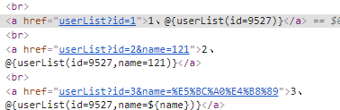
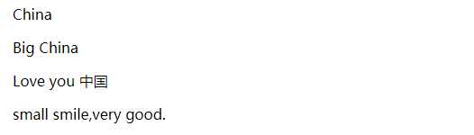

# Thymeleaf 标准表达式语法详解
## 汇总
`<html xmlns:th="http://www.thymeleaf.org">`

<div class="table-box"><table border="1" cellpadding="1" cellspacing="1"><tbody><tr><td style="text-align:center;width:47px;"><strong>编号</strong></td>
			<td style="text-align:center;width:79px;"><strong>属性</strong></td>
			<td style="text-align:center;width:385px;"><strong>描述</strong></td>
			<td style="text-align:center;width:339px;"><strong>示例</strong></td>
		</tr><tr><td style="width:47px;">1</td>
			<td style="width:79px;"><strong>$ {...}</strong></td>
			<td style="width:385px;">变量表达式，可用于获取后台传过来的值</td>
			<td style="width:339px;">&lt;p th:text="${userName}"&gt;中国&lt;/p&gt;</td>
		</tr><tr><td style="width:47px;">2</td>
			<td style="width:79px;">* {...}</td>
			<td style="width:385px;">选择变量表达式</td>
			<td style="width:339px;">&nbsp;</td>
		</tr><tr><td style="width:47px;">3</td>
			<td style="width:79px;">＃{...}</td>
			<td style="width:385px;">消息表达式</td>
			<td style="width:339px;">&nbsp;</td>
		</tr><tr><td style="width:47px;">4</td>
			<td style="width:79px;">@ {...}</td>
			<td style="width:385px;">链接址表达式，用于替换网页中的 src、href 等的值</td>
			<td style="width:339px;">th:href="@{/css/home.css}"</td>
		</tr><tr><td style="width:47px;">5</td>
			<td style="width:79px;">〜{...}</td>
			<td style="width:385px;">段表达式，可以用于引用公共的目标片段</td>
			<td style="width:339px;">&lt;div&nbsp;th:insert="~{footer :: copy}"&gt;&lt;/div&gt;</td>
		</tr></tbody></table></div>

## @{...}
### 处理 url 地址
Thymeleaf 的 @ {...} 表达式用于处理 web 应用中的 url 地址，可以是相对地址，也可以是绝对地址。
@{/}  斜杠开头表示相对整个应用根目录，"/" 表示 "/应用上下文路径"

假如页面当前浏览器地址为：`http://localhost/thymeleaf/user/userHome`，其中 thymeleaf 表示应用上下文路径，user/userHome 为后台请求路径，则常用的写法如下：
```
1）@{userList} 相对当前路径结果为：http://localhost/thymeleaf/user/userList

2）@{./userList} 相对当前路径结果为：http://localhost/thymeleaf/user/userList

3）@{../tiger/home} 相对当前路径结果为：http://localhost/thymeleaf/tiger/home

4）@{/tiger/home} 相对应用根目录结果为：http://localhost/thymeleaf/tiger/home

5）@{https://www.baidu.com/} 绝对路径结果为：https://www.baidu.com

6）<link type="text/css" rel="stylesheet" th:href="@{/css/home.css}">，@ 以 "/" 开头相对应用根目录，否则是相对当前路径。
```  

```
<body>
<a th:href="@{userList}">1、@{userList}</a>
<a th:href="@{./userList}">2、@{./userList}</a>
<a th:href="@{../tiger/home}">3、@{../tiger/home}</a>
<a th:href="@{/tiger/home}">4、@{/tiger/home}</a>
<a th:href="@{https://www.baidu.com}">5、@{https://www.baidu.com}</a>
</body>
```

### @{...} 携带参数
  th:href 是个修饰符属性，将表达式结果设置为标签 href 属性的值，请求地址中携带参数传往服务器是很常见的操作，常用操作如下：
```
<br/>
<a th:href="@{userList(id=1)}">1、@{userList(id=9527)}</a>
<br/>
<a th:href="@{userList(id=2,name=121)}">2、@{userList(id=9527,name=121)}</a>
<br/>
<a th:href="@{userList(id=3,name=${name})}">3、@{userList(id=9527,name=${name})}</a>
```
- 渲染结果： 

  

> 我们这里使用绝对路径，如下：
```
<a th:href="@{/news/list/{type}(type=${type},page=${indexPage},size=${size})}">上一页</a>
```
括号里的表示括号左边被大括号包起来的变量应该取得值，这里：
- type会被后端传来的type变量值赋值，
- page会被后端传来的indexPage变量值赋值，
- size会被后端传来的size变量值赋值。

> 它们作用的结果：
如果括号前出现了对应的大括号变量，映射时会替换掉，这里如果传来的type为"top"，则映射的url对应位置为/news/list/top
如果括号前没有出现对应的大括号变量，则会将括号里对应的变量变为url参数形式，即?page=1&size=10

###### 如果后端传参：
```
type = "top";
indexPage = "3";
size = "30";
```
url 结果：`http://localhost:8081/news/list/top?page=3&size=30`

# 文本及其操作
> 指包含在单引号之间的字符串，它们可以包含任何字符，但如果字符串有空格时，必须使用单引号" ' "包含。
```

<!--中间无空格时，可以不加单引号-->
<p th:text="China">中国</p>

<!--空格属于特殊字符，必须使用单引号包含整个字符串-->
<p class="css1 css2" th:class="'css1 css2'">样式</p>

<!--下面如果没用单引号 th:text="Big China"，则页面直接报错-->
<p th:text="'Big China'">中国</p>

<!--后台使用：model.addAttribute("name", "Love you 中国"); 传值有空格也是没有问题的-->
<p th:text="${name}">info</p>

<!--后台传值字符串有空格是可以的，可以使用 + 进行字符串连接-->
<p th:text="'small smile'+',very good.'">浅浅的微笑</p>
```

### 字符串追加
论是字符串⽂本常量，还是通过变量表达式或消息表达式计算的结果，都可以使⽤ "+" 运算符轻松地追加⽂本。

     `<span th:text="'The name of the user is ' + ${user.name}">`
### 数字字量
```
<!--直接用 80 替换-->
<p th:text="80">8</p>
<!--计算结果为 16 在进行替换-->
<p th:text="8+8">8 + 8</p>
<!--前面 8+8 计算结果为 16，然后字符串拼接上 Love，后面的 9+9也会被当做字符串拼接-->
<p th:text="8+8+' Love '+9+9">8 + 8+' Love '+9+9</p>
<!--前面 8+8 计算结果为 16，后面的 9+9因为有括号,所以也会计算结果，最后拼接 Love 字符串-->
<p th:text="8+8+' Love '+(9+9)">8 + 8+' Love '+(9+9)</p>
<!--后台传了一个：model.addAttribute("age", 35);取得结果后在进行计算-->
<p th:text="100-${age}"></p>
```
!()[../../image/37357560-C79F-4091-8DE0-718BE649D7AA.png]

### 布尔字量
     布尔字量包含 true 和 false：
     <!--直接用 true 替换了标签体内容-->
```
<p th:text="true">布尔</p>
<!--true、false 是布尔值，and 是布尔运行符，and(与)，or(或)，not(非)、!(非)-->
<p th:text="true and false">true and true</p>
 
<!--后台使用 model.addAttribute("isMarry", true); 传了值-->
<!--th:if 表达式为 true，则显示标签内容，否则不显示-->
<p th:if="${isMarry}">已结婚</p>
 
<!--后台传值：model.addAttribute("age", 35);-->
<!--比较运算符：&gt;，&lt;，&gt; =，&lt;=（gt，lt，ge，le）-->
<p th:if="${age}&gt;18">已成年</p>
<p th:if="${age}&lt;18">未成年</p>
```
### NULL 字量
```
<p th:text="null">show null</p>
<!--后台传了个值：model.addAttribute("id", null);-->
<!--当 id 的值为 null 时，整个标签不显示-->
<p th:text="${id}">id</p>
<!--相等运算符：==，！=（eq，ne）-->
<p th:if="${id} eq null">id 值为 null</p>
 
<!--后台传了个值：model.addAttribute("name", "");-->
<!--当 name 为空时，整个标签不再显示-->
<p th:text="${name}">为空</p>
<!--判断结果为 true-->
<p th:if="${name} == ''">name 为空</p>
```
### 算术运算符
    > Thyme Leaf 标准表达式⽀持算术运算：+， - ，*，/(除)，％(取余)
```
ody>
<canvas style="background-color: #999999" th:width="100" th:height="${age} + 15">
    您的浏览器不支持 Canvas
</canvas>
<p th:text="15 * 4">值为 60 </p>
<p th:text="15 * 4-100/10">值为 50 </p>
<p th:text="100 % 8">值为 4</p>
``` 
### 较/逻辑运算符
>  表达式中的值可以与 >，<，>= ，<= ，==，！= 符号进⾏⽐较。 ⼀个更简单的替代⽅案是使⽤这些运算符的⽂本别名：gt(>)，lt(<)，ge(>=)，le(<=)，eq(==)，neq(！=)。
     逻辑运算符：and(与)、or(或)、！(非)，not(非)
```
<p th:if="5>3">5 大于 3</p>
<p th:if="5 &gt;4">5 大于 4</p>
<p th:if="10>=8 and 7 !=8">10大于等于8，且 7 不等于 8 </p>
<p th:if="!false">!false</p>
<p th:if="not(false)">not(false)</p>
```
### 三元运算符
```
> Thymeleaf 中的三元运算与 Java 以及 JavaScript 中基本一致，如 A>B?X:Y，在 X、Y 中可以继续嵌套，只是 Thymeleaf 中需要使用括号包含起来，否则报错。
<p th:text="7&gt;5?'7大':'5大'">三元运算符</p>
<!--后台控制器输出了：model.addAttribute("age", 35);-->
<!--因为 ${xx}取值时，如果值为null，则默认整个标签不再显示-->
<p th:text="${age}!=null?${age}:'age等于 null'"></p>
<!--这里使用嵌套判断，嵌套的部分要使用括号-->
<p th:text="${age}!=null?(${age}>=18?'成年':'未成年'):'age等于 null'"></p>
<!--变量 age2 后台并没有输出，所以 age2 不存在，此时 age2 ==null-->
<p th:text="${age2}!=null?${age2}:'age2等于 null'"></p>
 
<!--后台输出了：model.addAttribute("isMarry", true);-->
<!--A>B?X:Y，这里的 Y 部分是省略的，此时如果 A>B 返回 false，则整个三元运算结果为 null-->
<p th:class="${isMarry}?'css2'">已婚</p>
<p th:text="!${isMarry}?'css2'">已婚</p>
```
