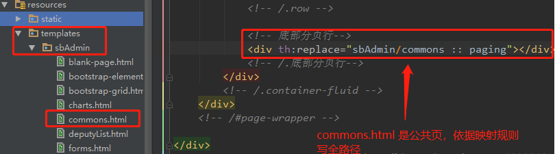

# Thymeleaf 模板布局 th:fragment、th:replace、th:insert、th:remove
## th:fragment  模板布局
### 模板片段说明
     模板中，经常希望从其他模板中包含某些部分，如页眉，页脚，公共菜单等部分，为了做到这点，Thymeleaf 可以使用th:fragment 属性来定义被包含的模版片段，以供其他模版包含。

如下所示定义模板片段：
```
<div th:fragment="copy">
      &copy; 2011 The Good Thymes Virtual Grocery
</div>
```

上面的代码定义了一个名为 copy 的片段，然后可以使用 th:insert 或 th:replace属性（Thymeleaf 3.0 不再推荐使⽤ th:include）轻易地包含进需要的页面中。
```
<body>
     ...     <div th:insert="~{footer :: copy}"></div>     ...
</body>
```

footer：表示模板名称，就是 html 文件的名称，如果是 springboot 开发，则根据 Spring Boot 配置的 Thymeleaf 映射查找。

copy：表示模板片段名称，即 th:fragment="copy" 的名称

th:insert 中的 〜{...} 表示⽚段表达式，它是可选的，上⾯的代码等价于如下所示写法，这也是实际开发中常用的写法：
```
<body>
     ...     <div th:insert="footer :: copy"></div>     ...
</body>
```
## 片段表达式语法
1、`th:insert/th:replace` 中,`〜{...}` 片段表达式是可选的，可写可不写

2、被引用的 `th:fragment` 模板片段与引用的`th:insert` 或` th:replace` 可以是在同一个 Html 文件中，也可以不在同一个 html 中。

> 片段表达式语法⾮常简单，有如下三种不同的格式：
1）〜{templatename :: selector} -:- templatename 表示模板名称(html 文件名称)，springboot 项目中就是 “templates”目录下的 html 文件名称，它根据 springboot 对 thymeleaf 的规则进行映射。selector 即可以是 th:fragment 定义的片段名称，也可以选择器，如标签的 id 值、CSS 选择器、或者 XPath 等。
2）〜{templatename} -:- 包含名为 templatename 的整个模板。
3）〜{:: selector} 或 〜{this :: selector}：包含在同⼀模板中的指定选择器的⽚段

模板名 templatename  和选择器 selector 都可以是表达式（甚至是条件表达式！）如：

<div th:insert="footer :: (${user.isAdmin}? #{footer.admin} : #{footer.normaluser})"></div>

再次注意，th:insert/th:replace 中的 〜{...} 是可选的。

〜{templatename :: selector} 中的 selector 可以是普通的选择器，如标签的 id 值、CSS 选择器、或者 XPath 等：

```
<div id="copy-section"> &copy; 2011 The Good Thymes Virtual Grocery</div>
```

可以直接通过 ID 属性来引用片段，也可以是 CSS 选择器(.content)、XPath (//div[@class='content'])：

```
<div th:insert="~{footer :: #copy-section}"></div>
```

## th:insert 与 th:replace 区别
Thymeleaf 3.0 之后不再推荐使 th:include.

th:insert：将被引用的模板片段插入到自己的标签体中
th:replace：将被引用的模板片段替换掉自己
th:include：类似于 th:insert，但不是插入片段，它只插入此片段的内容。
```
<!--1、比如抽取的公用代码片段如下-->
<footer th:fragment="copy">
    &copy; 2011 The Good Thymes Virtual Grocery
</footer>
 
<!--2、采用如下三种方式进行引用-->
<div th:insert="footer :: copy"></div>
<div th:replace="footer :: copy"></div>
<div th:include="footer :: copy"></div>
 
<!--3、则三种引用方式的效果分别对应如下-->
<div>
    <footer>
        &copy; 2011 The Good Thymes Virtual Grocery
    </footer>
</div>
 
<footer>
    &copy; 2011 The Good Thymes Virtual Grocery
</footer>
 
<div>
    &copy; 2011 The Good Thymes Virtual Grocery
</div>
```
再次强调：

> 1）th:fragment 与 th:insert、th:replace、th:include 可以在同一模板中，也可以是在不同的模板中
2）th:insert 、th:replace、th:include 在标签中进行引用时可以不用片段表达式 〜{...} ，但是行内写法时，必须要用片段表达式，如：[[~{}]]、[(~{})]

## 参数化片段签名
为了使模板片段具有类似函数的功能，th:fragment 定义的片段可以指定一组参数：
```
<div th:fragment="frag (onevar,twovar)">
     <p th:text="${onevar} + ' - ' + ${twovar}">...</p>
</div>
```

于是在 th:insert、th:replace 引用模板片段的时候，就可以传递参数过去：
```
<div th:replace="templatename :: frag (${value1},${value2})">...</div>     //按参数定义时的顺序进行传递
<div th:replace="templatename :: frag (onevar=${value1},twovar=${value2})">...</div>     //按参数名称传递，此时与参数定义的顺序无关
```
比如公共菜单中高亮显示当前菜单时就可以使用这种传递参数的方式进行标识当前活动的菜单。

## th:remove 删除模版片段
     如果想在某些情况下直接删除模板中的某些代码片段，则可以使用 th:remove，如 `<tr th:remove="all">`...。

### th:remove 可以有五种不同的删除⽅式：

- 1）all：删除包含标签及其所有选项
- 2）body：不删除包含标签，但删除所有的选项
- 3）tag：删除包含标签，但不要删除其它项
- 4）all-but-first：删除第一个子项以外的其它所有子项
- 5）none：什么都不做。 该值对于动态计算有为null 也会被视为 none
```
<body>
<!--hint 样式会为 div 加一个 1px 的红色边框-->
<div class="hint">
    <p>th:remove<span> !</span></p>
</div>
<!--all：删除所有标签，包含自己-->
<div class="hint" th:remove="all">
    <p>all<span> @</span></p>
</div>
<!--body：不删除自己，但删除所有子项-->
<div class="hint" th:remove="body">
    <p>body<span> #</span></p>
</div>
<!--tag：删除自己，但不删除所有子项-->
<div class="hint" th:remove="tag">
    <p>tag<span> $</span></p>
</div>
<!--all-but-first：除第一个子项以外，删除其它所有子项-->
<div class="hint" th:remove="all-but-first">
    <p>all-but-first1<span> %</span></p>
    <!-- 上面第一个子项不会被删除，从第二个子项开始全部会被删除-->
    <p>all-but-first2<span> %</span></p>
</div>
<!--none：不做任何处理。该值对于动态计算时有用-->
<div class="hint" th:remove="none">
    <p>none<span> ^</span></p>
</div>
</body>
```

     只要 th:remove 返回一个允许的字符串值（all，tag，body，all-but-first ，none），则 th:remove 属性可以使用任何 Thymeleaf 标准表达式，如：
```
<a href="/something" th:remove="${condition}? tag : none">Link text not to be removed</a>
```
     th:remove 将 null 视为 none，因此以下面作与上述示例作用相同：
```
<a href="/something" th:remove="${condition}? tag">Link text not to be removed</a>
```

     在这种情况下，如果 $ {condition} 为 false，则返回 null，因此不会执行删除。
