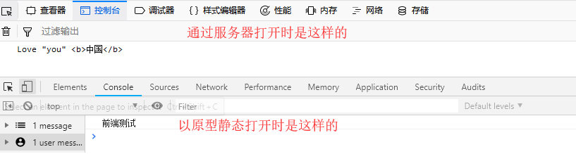
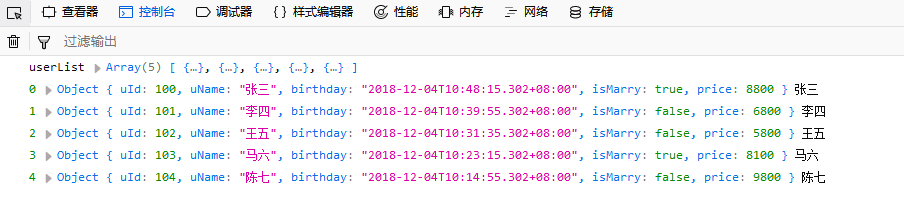

# Thymeleaf 内联表达式、文本、JavaScript、CSS
## 内联表达式
     虽然通过 Thymeleaf 标准中的标签属性已经几乎满足了开发中的所有需求，但是有些情况下更喜欢将表达式直接写到 HTML 文本中：

例如有时候这样更合适：`<p>Hello, [[${session.user.name}]]</p>`
而不喜欢这样写代码：`<p>Hello, <span th:text="${session.user.name}">Sebastian</span>!</p>`

     [[...]] 或 [(...)] 中的表达式就是 Thymeleaf 中内联表达式，任何在 th:text 或 th:utext 属性中使用的表达式都可以出现在 [[]] 或 [()] 中使用， [[...]] 等价于 th:text（结果将被 HTML 转义），[(...)] 等价于 th:utext（结果不会执行HTML转义）。
```
<body>
<!--后台传出：model.addAttribute("info", "Love you <b>中国</b>");-->
<!--/*前者会转义，后者不会转义*/-->
<p>[[${info}]]</p>
<p>[(${info})]</p>
 
<!--/*可以是任意的数据类型，如普通的文本，与 th:text、th:utext完全等价*/-->
<p>[[Love]]</p>
<p>[['I Love You Baby']]</p>
<p>[(9527)]</p>
</body>
```
提示：当静态打开 HTML 文件时，内嵌的表达式将逐字显示在 HTML 文件中，因此无法将其看作设计原型了！比如 “<p>[[${info}]]</p>” 如果是以静态原型打开，那么显示的就是 <p>[[${info}]]</p>。

### th:inline="none" 禁用内联
     内联机制可以被禁用，因为在实际应⽤中可能会想输出 [[...]] 或 [(...)] 序列⽽不将其内容作为表达式处理的情况。 为此将使⽤ 
th:inline =“none” 来禁⽤内联。
```
<body>
<!--/*禁用内联表达式*/-->
<p th:inline="none">[[${info}]]</p>
<p th:inline="none">[(${info})]</p>
 
<!--/*禁用内联表达式*/-->
<p th:inline="none">[[Love]]</p>
<p th:inline="none">[['I Love You Baby']]</p>
<p th:inline="none">[(9527)]</p>
<p th:inline="none">[[1,2,3,4,5]]</p>
</body>
```

### 内联 JavaScript
     JavaScript 内联允许在 HTML 模板模式中更好地集成 JavaScript `<script>`块。与文本内联，这实际上等同于处理脚本内容，就像它们是JavaScript 模板模式中的模板，因此文本模板模式的所有功能都可以在内联脚本中使用。 
     必须使用 th:inline ="javascript" 显式的启用此 JavaScript 模板模式：
```
<head lang="en">
    <meta charset="UTF-8">
    <title>用户首页</title>
    <link type="text/css" rel="stylesheet" th:href="@{/css/userHome.css}">
 
    <script type="text/javascript" th:inline="javascript">
        /**
         * 后台输出：
         * model.addAttribute("info", "Love you <b>中国</b>");
         * model.addAttribute("age", 35);//注意：使用 [(${info})] 时编译报错，浏览器运行也会报错
         * model.addAttribute("id", null);
         * model.addAttribute("name", "");
         * @type {*[]}
         */
        var info = [[${info}]];
        var age = [[${age}]];
        var id = [[${id}]];
        var name = [[${name}]];
        console.log(id, name, age, info);
    </script>
</head>
```

特别提示：th:inline ="javascript" 显式启用 JavaScript 模板模式只能是在 Html 文件内部的 JavaScript 代码，如上所示。不能在引入的外部 JavaScript 文件中进行操作，如：
```
<script type="text/javascript" th:inline="javascript" th:src="@{/js/userHome.js}"></script>
```
//如果在这个外置的 userHome.js 中进行内联表达式操作，则 Thymeleaf 无法解析，浏览器识别不了而报错。
### JavaScript 模版
     Thymeleaf 的目标就是希望前后端分离，即同一个 Html 文件前端人员以静态原型的方式打开时，看到的是它们的内容，而后端人员通过服务器打开时，看到的是动态的数据。内联的 JavaScript 同样可以实现这一点。在 JavaScript 注释中包含（转义）内联表达式即可满足此需求。
```
    <script type="text/javascript" th:inline="javascript">
        /**
         * 后台输出：model.addAttribute("info", "Love you <b>中国</b>");
         * Thymeleaf 将自动忽略掉注释之后 和 分号之前的所有内容,如下为 "前端测试"
         */
        var info = /*[[${info}]]*/ "前端测试";
        console.log(info);
    </script>
```

 ### 内联表达式JS序列化
     关于 JavaScript 内联的一个重要的特性是，内联表达式的计算结果不限于字符串，它能将以下对象序列化为 javascript 对象。 Thymeleaf 支持以下多种序列化对象：

1）Strings
2）Numbers
3）Booleans
4）Arrays
5）Collections
6）Maps
7）Beans (有getter _and _setter⽅法)

     Thymeleaf 对 JavaScript 序列化的方式是通过 org.thymeleaf.standard.serializer.IStandardJavaScriptSerializer 接⼝的实
现，可以在模板引擎的 StandardDialect 的实例中进⾏配置。

     该 JavaScript 序列化机制默认将在类路径中查找 Jackson 库，如果存在，将使用它。 如果没有，它将应用⼀个内置的序列化机制，内置的序列化机制涵盖大多数场景的需求，并和 Jackson 序列化机制产⽣类似的结果。

     这里以后台控制器传出一个 List<User> 对象为例进行说明，其它都是同理，User 是 Java Beab，提供了 getter、setter 方法。
```
    <script type="text/javascript" th:inline="javascript">
        /**
         * 后台输出：model.addAttribute("userList", userList);
         * userList 是一个 List<User> 的结构，其中有5个元素
         */
        var userList = [[${userList}]];
        /**已经被 Thymeleaf 序列化为 JS 对象，是一个数组加Object 的个数，即数组中有5个Object*/
        console.log("userList", userList);
        for (let i = 0; i < userList.length; i++) {
            /**取值打印*/
            console.log(i, userList[i], userList[i].uName);
        }
    </script>
```


## 内联 CSS
Thymeleaf 还允许在 CSS `<style>` 标签中使用内联，如：
```
<style th:inline="css">
   ...
</style>

<head lang="en">
    <meta charset="UTF-8">
    <title>用户首页</title>
    <link type="text/css" rel="stylesheet" th:href="@{/css/userHome.css}">
    <!--/*为了测试简单，直接使用 th:with 定义两个局部变量；也可以后台传输来的*/-->
    <style type="text/css" th:inline="css" th:with="h4Color='yellow',fontSize='25px'">
        p {
            color: [[${h4Color}]];
            font-size: [(${fontSize}) ];
        }
    </style>
</head>
```

注意事项：

> 1）获取变量赋值时，fontSizt 需要使用 [(...)] 不进行转义，如果是 [[...]] 转义则会多出来一个斜杠而导致无效。
2）与内联 JavaScript 一样，CSS 内联也允许 `<style>` 标签可以静态和动态地，即通过在注释中包含内联表达式作为CSS 模板。
```
<style type="text/css" th:inline="css" th:with="h4Color='yellow',fontSize='25px'">
    p {
        color: /*[[${h4Color}]]*/ red;
        font-size: [(${fontSize})];
    }
</style>
```
3）如上所示当服务器动态打开时，字体颜色为黄色；当以原型静态打开时，显示的是红色，因为 Thymeleaf 会自动忽略掉 css 注释之后 和 分号之前的代码。

4）因为 CSS 自然模板的问题，所以不能在 css 中像以前一样添加注释，因为 Thymeleaf 会将它们当做模板进行处理。

5）与 内联 JavaScript 一样，内联 CSS 同样只能 Html 内嵌的 <style 标签中进行使用，不能在外部 关联的 CSS 文件中进行使用。
```
<link type="text/css" rel="stylesheet" th:href="@{/css/userHome.css}" th:inline="css">
//这是错误的，不能在 userHome.css 文件中使用内联 CSS。
```