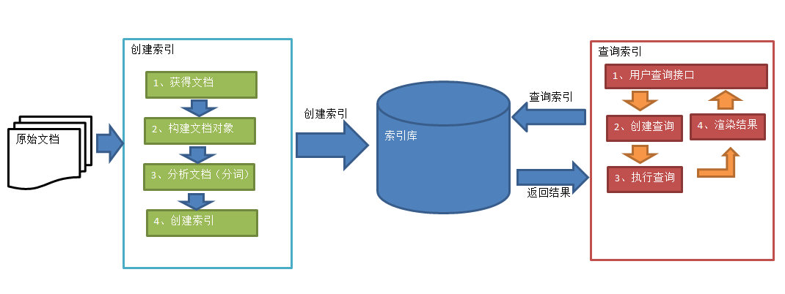
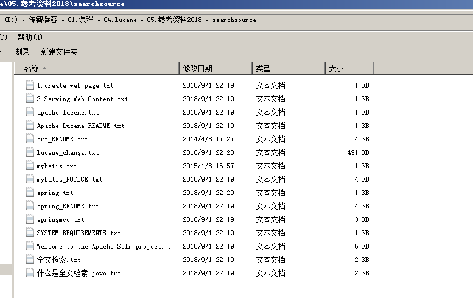
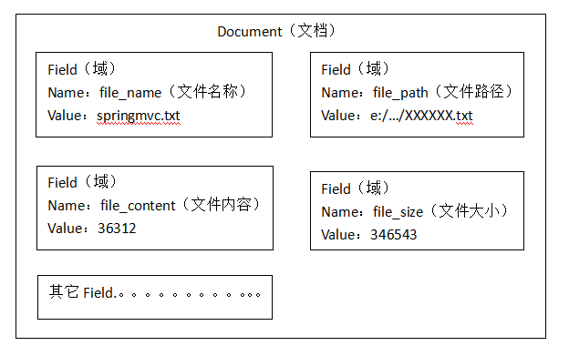

# 全文检索技术 
## 1.什么是全文检索
### 1.1数据分类
我们生活中的数据总体分为两种：结构化数据和非结构化数据。
结构化数据：指具有固定格式或有限长度的数据，如数据库，元数据等。
非结构化数据：指不定长或无固定格式的数据，如邮件，word文档等磁盘上的文件
### 1.2结构化数据搜索
常见的结构化数据也就是数据库中的数据。在数据库中搜索很容易实现，通常都是使用sql语句进行查询，而且能很快的得到查询结果。
为什么数据库搜索很容易？
因为数据库中的数据存储是有规律的，有行有列而且数据格式、数据长度都是固定的。
### 1.3非结构化数据查询方法
- （1）顺序扫描法(Serial Scanning)
所谓顺序扫描，比如要找内容包含某一个字符串的文件，就是一个文档一个文档的看，对于每一个文档，从头看到尾，如果此文档包含此字符串，则此文档为我们要找的文件，接着看下一个文件，直到扫描完所有的文件。如利用windows的搜索也可以搜索文件内容，只是相当的慢。
- （2）全文检索(Full-text Search)
将非结构化数据中的一部分信息提取出来，重新组织，使其变得有一定结构，然后对此有一定结构的数据进行搜索，从而达到搜索相对较快的目的。这部分从非结构化数据中提取出的然后重新组织的信息，我们称之索引。
> 例如：字典。字典的拼音表和部首检字表就相当于字典的索引，对每一个字的解释是非结构化的，如果字典没有音节表和部首检字表，在茫茫辞海中找一个字只能顺序扫描。然而字的某些信息可以提取出来进行结构化处理，比如读音，就比较结构化，分声母和韵母，分别只有几种可以一一列举，于是将读音拿出来按一定的顺序排列，每一项读音都指向此字的详细解释的页数。我们搜索时按结构化的拼音搜到读音，然后按其指向的页数，便可找到我们的非结构化数据——也即对字的解释。
这种先建立索引，再对索引进行搜索的过程就叫全文检索(Full-text Search)。
虽然创建索引的过程也是非常耗时的，但是索引一旦创建就可以多次使用，全文检索主要处理的是查询，所以耗时间创建索引是值得的。
### 1.4如何实现全文检索
可以使用Lucene实现全文检索。Lucene是apache下的一个开放源代码的全文检索引擎工具包。提供了完整的查询引擎和索引引擎，部分文本分析引擎。Lucene的目的是为软件开发人员提供一个简单易用的工具包，以方便的在目标系统中实现全文检索的功能。

### 1.5全文检索的应用场景
对于数据量大、数据结构不固定的数据可采用全文检索方式搜索，比如百度、Google等搜索引擎、论坛站内搜索、电商网站站内搜索等。
## 2.Lucene实现全文检索的流程
### 2.1索引和搜索流程图

1、绿色表示索引过程，对要搜索的原始内容进行索引构建一个索引库，索引过程包括：
确定原始内容即要搜索的内容->采集文档->创建文档->分析文档->索引文档
	
2、红色表示搜索过程，从索引库中搜索内容，搜索过程包括：
用户通过搜索界面->创建查->询执行搜索，从索引库搜索->渲染搜索结果
### 2.2创建索引
对文档索引的过程，将用户要搜索的文档内容进行索引，索引存储在索引库（index）中。
这里我们要搜索的文档是磁盘上的文本文件，根据案例描述：凡是文件名或文件内容包括关键字的文件都要找出来，这里要对文件名和文件内容创建索引。
## 3.2.1获得原始文档
原始文档是指要索引和搜索的内容。原始内容包括互联网上的网页、数据库中的数据、磁盘上的文件等。 
本案例中的原始内容就是磁盘上的文件，如下图：


从互联网上、数据库、文件系统中等获取需要搜索的原始信息，这个过程就是信息采集，信息采集的目的是为了对原始内容进行索引。
在Internet上采集信息的软件通常称为爬虫或蜘蛛，也称为网络机器人，爬虫访问互联网上的每一个网页，将获取到的网页内容存储起来。
本案例我们要获取磁盘上文件的内容，可以通过文件流来读取文本文件的内容，对于pdf、doc、xls等文件可通过第三方提供的解析工具读取文件内容，比如Apache POI读取doc和xls的文件内容。
### 2.2.2创建文档对象
获取原始内容的目的是为了索引，在索引前需要将原始内容创建成文档（Document），文档中包括一个一个的域（Field），域中存储内容。
这里我们可以将磁盘上的一个文件当成一个document，Document中包括一些Field（file_name文件名称、file_path文件路径、file_size文件大小、file_content文件内容），如下图：


注意：每个Document可以有多个Field，不同的Document可以有不同的Field，同一个Document可以有相同的Field（域名和域值都相同）

每个文档都有一个唯一的编号，就是文档id。
### 3.2.3分析文档
将原始内容创建为包含域（Field）的文档（document），需要再对域中的内容进行分析，分析的过程是经过对原始文档提取单词、将字母转为小写、去除标点符号、去除停用词等过程生成最终的语汇单元，可以将语汇单元理解为一个一个的单词。

比如下边的文档经过分析如下：
原文档内容：
```
Lucene is a Java full-text search engine.  Lucene is not a complete
application, but rather a code library and API that can easily be used
to add search capabilities to applications.
```

分析后得到的语汇单元：
> lucene、java、full、search、engine。。。。

每个单词叫做一个Term，不同的域中拆分出来的相同的单词是不同的term。term中包含两部分一部分是文档的域名，另一部分是单词的内容。
例如：文件名中包含apache和文件内容中包含的apache是不同的term。
### 3.2.4创建索引
对所有文档分析得出的语汇单元进行索引，索引的目的是为了搜索，最终要实现只搜索被索引的语汇单元从而找到Document（文档）。


注意：创建索引是对语汇单元索引，通过词语找文档，这种索引的结构叫倒排索引结构。
传统方法是根据文件找到该文件的内容，在文件内容中匹配搜索关键字，这种方法是顺序扫描方法，数据量大、搜索慢。
倒排索引结构是根据内容（词语）找文档，如下图： 


倒排索引结构也叫反向索引结构，包括索引和文档两部分，索引即词汇表，它的规模较小，而文档集合较大。
3.3查询索引