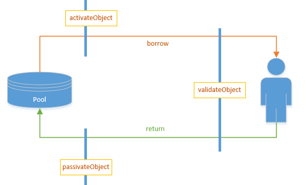

# commons-pool2
> commons-pool2是Apache下一个开源的公共资源池。我们可以根据它来快速的建立一个自己的对象池。
## 1. 相关概念:
- 链接池/对象池(ObjectPool):用于存放链接对象的一个池子(集合),通常用数组或者List对象.durid用两个数组分别保存活跃的链接和空闲链接.commons-pool2用双端阻塞队列LinkedBlockingDeque保存空闲链接 
- 用ConcurrentHashMap保存所有的链接.
- 对象工厂(PooledObjectFactory):连接池工厂，用于产生一个新的链接对象.
- 链接对象/池中对象(PooledObject):链接池里面存放的对象.
## 2.相关API
### 2.1 GenericObjectPool 
> 简单说这就是池，传说中的对象池，实现对象存取和状态管理的：如线程池，数据库连接池都可以用这个
GenericObjectPool继承BaseGenericObjectPool实现ObjectPool，通常用此实现来作为默认的连接池对象。 
BaseGenericObjectPool一个抽象类，主要实现了两个功能：

1、注册JMX
2、管理一个连接池驱逐线程，此线程调用GenericObjectPool的evict()驱逐超过最大生命周期的连接对象。
> ObjectPool连接池的最上层接口，定义了一个连接池必须具备的方法，比如借用一个连接对象T borrowObject(),归还一个使用后的连接对象void returnObject(T obj)。
### 2.2 PooledObjectFactory
PooledObjectFactory用于生成连接对象的工厂接口。该接口包含以下功能：

##### 产生一个连接对象：
> 工厂类，负责具体的对象创建，初始化,对象状态销毁和验证
```
public PooledObject<T> makeObject() throws Exception {
        return wrap(create());//create方法创建一个整数对象。wrap方法将这个对象包装成PooledObject对象
    }
```

在连接池初始化时初始化最小连接数 
驱逐线程驱逐完过期连接后池中连接数<最小连接数，需重新生成连接，使连接数达到池中最小连接数 
获取新的连接时，池中连接对象均被占用，但当前连接数<总连接数时 
一般当遇到以上3中情况时需要调用该方法产生一个新的连接

#####  销毁一个连接对象：

```void destroyObject(PooledObject<T> p) throws Exception;```

调用该方法销毁一个连接对象。对于实现这个方法来说非常重要的是要考虑到处理异常情况，另外实现必须考虑一个实例如果与垃圾回收器失去联系那么永远不会被销毁。

#####  校验方法

```boolean validateObject(PooledObject<T> p);```

此方法主要用于校验一个连接是否可用，比如在borrow一个连接时或者return一个连接时，调用该方法检测连接是否可用。需要注意的是校验方法只会作用于激活的对象实例上。通常的做法是在连接对象空闲的时候进行校验，而不是在使用的时候进行校验，因为这样会影响性能。

#####  重新激活一个对象

```void activateObject(PooledObject<T> p) throws Exception;```

激活一个对象，在向对象池归还被钝化过的对象时调用该方法。

#####  钝化一个对象

void passivateObject(PooledObject<T> p) throws Exception;

钝化一个对象。在向对象池归还一个对象是会调用这个方法。 
当一个对象从借用到归还需经过如下流程： 

### 2.3 DefaultPooledObject
DefaultPooledObject 默认的对象包装器用于跟踪其他信息，例如状态。实现了PooledObject。
### 2.4 GenericKeyedObjectPool
类似于GenericObjectPool，每个key对应一个subPool，，每个key对应一个GenericObjectPool。它用于区别不同类型的对象。实际上是通过ConcurrentHashMap来保存每个key的PooledObject。
### 2.5 BaseObjectPoolConfig
一个参数配置抽象类，用于自定义对象池参数。 
- boolean lifo 
对象池存储空闲对象是使用的LinkedBlockingDeque，它本质上是一个支持FIFO和FILO的双向的队列，common-pool2中的LinkedBlockingDeque不是Java原生的队列，而有common-pool2重新写的一个双向队列。如果为true，表示使用FIFO获取对象。 
- boolean fairness 
common-pool2实现的LinkedBlockingDeque双向阻塞队列使用的是Lock锁。这个参数就是表示在实例化一个LinkedBlockingDeque时，是否使用lock的公平锁。默认值是false。 (公平锁是线程安全中的概念，true的含义是谁先等待获取锁，随先在锁释放的时候获取锁，如非必要，一般不使用公平锁，会影响性能)
- long maxWaitMillis 
当没有空闲连接时，获取一个对象的最大等待时间。如果这个值小于0，则永不超时，一直等待，直到有空闲对象到来。如果大于0，则等待maxWaitMillis长时间，如果没有空闲对象，将抛出NoSuchElementException异常。默认值是-1；可以根据需要自己调整，单位是毫秒。 
- long minEvictableIdleTimeMillis 
对象最小的空闲时间。如果为小于等于0，最Long的最大值，如果大于0，当空闲的时间大于这个值时，执行移除这个对象操作。默认值是1000L * 60L * 30L;即30分钟。可以避免(连接)泄漏。 
- long evictorShutdownTimeoutMillis 
shutdown驱逐线程的超时时间。当创建驱逐线(evictor)程时，如发现已有一个evictor正在运行则会停止该evictor，evictorShutdownTimeoutMillis表示当前线程需等待多长时间让ScheduledThreadPoolExecutor(evictor继承自TimerTask，由ScheduledThreadPoolExecutor进行调度)停止该evictor线程。 
- long softMinEvictableIdleTimeMillis 
对象最小的空间时间，如果小于等于0，取Long的最大值，如果大于0，当对象的空闲时间超过这个值，并且当前空闲对象的数量大于最小空闲数量(minIdle)时，执行移除操作。这个和上面的minEvictableIdleTimeMillis的区别是，它会保留最小的空闲对象数量。而上面的不会，是强制性移除的。默认值是-1； 
- int numTestsPerEvictionRun 
检测空闲对象线程每次检测的空闲对象的数量。默认值是3；如果这个值小于0,则每次检测的空闲对象数量等于当前空闲对象数量除以这个值的绝对值，并对结果向上取整。 
- boolean testOnCreate 
在创建对象时检测对象是否有效，true是，默认值是false。做了这个配置会降低性能。 
- boolean testOnBorrow 
在从对象池获取对象时是否检测对象有效，true是；默认值是false。做了这个配置会降低性能。 
- boolean testOnReturn 
在向对象池中归还对象时是否检测对象有效，true是，默认值是false。做了这个配置会降低性能。 
- boolean testWhileIdle 
在检测空闲对象线程检测到对象不需要移除时，是否检测对象的有效性。true是，默认值是false。建议配置为true，不影响性能，并且保证安全性。 
- long timeBetweenEvictionRunsMillis 
空闲对象检测线程的执行周期，即多长时候执行一次空闲对象检测。单位是毫秒数。如果小于等于0，则不执行检测线程。默认值是-1; 
- boolean blockWhenExhausted 
当对象池没有空闲对象时，新的获取对象的请求是否阻塞。true阻塞。默认值是true; 
- boolean jmxEnabled 
是否注册JMX 
- String jmxNamePrefix 
JMX前缀 
- String jmxNameBase 
使用base + jmxNamePrefix + i来生成ObjectName 
- int maxTotal 
对象池中管理的最多对象个数。默认值是8。 
- int maxIdle 
对象池中最大的空闲对象个数。默认值是8。 
- int minIdle 
对象池中最小的空闲对象个数。默认值是0。

### 3.demo
- objc 对象
```
public class Student {
  private String name;
  private int age;
    //get、set
}
```
- PooledObjectFactory 
```
public class StudentFactory extends BasePooledObjectFactory<Student> {
  private Random random = new Random();

  @Override
  public Student create() throws Exception {
    int age = random.nextInt(100);
    Student student = new Student("commons-pool", age);
    System.out.println("创建对象:" + student);
    return student;
  }

  @Override
  public PooledObject<Student> wrap(Student obj) {
    return new DefaultPooledObject<Student>(obj);
  }

  @Override
  public void destroyObject(PooledObject<Student> p) throws Exception {
    System.out.println("销毁对象：" + p.getObject());
    super.destroyObject(p);
  }

  // 验证是否有效
  @Override
  public boolean validateObject(PooledObject<Student> p) {
    System.out.println("校验对象是否可用：" + p.getObject());
    return super.validateObject(p);
  }

  @Override
  // 借取时回调
  public void activateObject(PooledObject<Student> p) throws Exception {
    System.out.println("激活钝化的对象系列操作：" + p.getObject());
    super.activateObject(p);
  }

  @Override
  // 归回时回调
  public void passivateObject(PooledObject<Student> p) throws Exception {
    System.out.println("钝化未使用的对象：" + p.getObject());
    super.passivateObject(p);
  }
}
```
- test
```
 @Test
  public void pool() throws Exception {
    StudentFactory studentFactory = new StudentFactory();
    GenericObjectPoolConfig<Student> studentGenericObjectPoolConfig =
        new GenericObjectPoolConfig<>();
    AbandonedConfig abandonedConfig = new AbandonedConfig();
    CommonObjectPool pool =
        new CommonObjectPool(studentFactory, studentGenericObjectPoolConfig, abandonedConfig);

    Student student;

    student = pool.borrowObject();
    System.out.println(student);
    if (student != null) pool.returnObject(student);
    System.out.println(student);
  }
```
[demo获取](https://github.com/AndyYoungCN/springbootexample/tree/master/source/commonspool2)
### 4.下面结合源码和例子讲解执行过程
#### 4.1 先是通过对象工厂类和配置初始化了一个pool，pool的初始化操作代码如下：
```
public GenericObjectPool(final PooledObjectFactory<T> factory,
            final GenericObjectPoolConfig config) {
 
        super(config, ONAME_BASE, config.getJmxNamePrefix());
 
        if (factory == null) {
            jmxUnregister(); // tidy up
            throw new IllegalArgumentException("factory may not be null");
        }
        this.factory = factory;
 
        idleObjects = new LinkedBlockingDeque<>(config.getFairness());
 
        setConfig(config);
 
        startEvictor(getTimeBetweenEvictionRunsMillis());
 }
```
#### 4.2 主要的工作就是设置工厂类，配置，开启驱逐线程。下面先介绍驱逐线程的工作机制：
```
final void startEvictor(final long delay) {
        synchronized (evictionLock) {
            if (null != evictor) {
                EvictionTimer.cancel(evictor, evictorShutdownTimeoutMillis, TimeUnit.MILLISECONDS);
                evictor = null;
                evictionIterator = null;
            }
            if (delay > 0) {
                evictor = new Evictor();
                EvictionTimer.schedule(evictor, delay, delay);
            }
        }
}
```
如果设置过了就会关闭，不然要delay大于0才会开启该线程，该值就是config中的getTimeBetweenEvictionRunsMillis。开启方式就是通过EvictionTimer的周期任务，这实际上就是一个Timer定时器。该定时器做的工作如下：
```
public void run() {
        final ClassLoader savedClassLoader =
                Thread.currentThread().getContextClassLoader();
        try {
            if (factoryClassLoader != null) {
                // Set the class loader for the factory
                final ClassLoader cl = factoryClassLoader.get();
                if (cl == null) {
                    // The pool has been dereferenced and the class loader
                    // GC'd. Cancel this timer so the pool can be GC'd as
                    // well.
                    cancel();
                    return;
                }
                Thread.currentThread().setContextClassLoader(cl);
            }
 
            // Evict from the pool
            try {
                evict();
            } catch(final Exception e) {
                swallowException(e);
            } catch(final OutOfMemoryError oome) {
                // Log problem but give evictor thread a chance to continue
                // in case error is recoverable
                oome.printStackTrace(System.err);
            }
            // Re-create idle instances.
            try {
                ensureMinIdle();
            } catch (final Exception e) {
                swallowException(e);
            }
        } finally {
            // Restore the previous CCL
            Thread.currentThread().setContextClassLoader(savedClassLoader);
        }
    }
```
可以看出，先进行了驱逐，再判断是否小于minIdle的设置，小于就会再次创建对象。
```
private void ensureIdle(final int idleCount, final boolean always) throws Exception {
        if (idleCount < 1 || isClosed() || (!always && !idleObjects.hasTakeWaiters())) {
            return;
        }
 
        while (idleObjects.size() < idleCount) {
            final PooledObject<T> p = create();
            if (p == null) {
                // Can't create objects, no reason to think another call to
                // create will work. Give up.
                break;
            }
            if (getLifo()) {
                idleObjects.addFirst(p);
            } else {
                idleObjects.addLast(p);
            }
        }
        if (isClosed()) {
            // Pool closed while object was being added to idle objects.
            // Make sure the returned object is destroyed rather than left
            // in the idle object pool (which would effectively be a leak)
            clear();
        }
}
```
就是调用create方法创建，根据lifo的参数决定是先入先出还是后入先出。evict方法主要做了如下操作：
```
public void evict() throws Exception {
    assertOpen();
 
    if (idleObjects.size() > 0) {
 
        PooledObject<T> underTest = null;
        final EvictionPolicy<T> evictionPolicy = getEvictionPolicy();
 
        synchronized (evictionLock) {
            final EvictionConfig evictionConfig = new EvictionConfig(
                    getMinEvictableIdleTimeMillis(),
                    getSoftMinEvictableIdleTimeMillis(),
                    getMinIdle());
 
            final boolean testWhileIdle = getTestWhileIdle();
 
            for (int i = 0, m = getNumTests(); i < m; i++) {
                if (evictionIterator == null || !evictionIterator.hasNext()) {
                    evictionIterator = new EvictionIterator(idleObjects);
                }
                if (!evictionIterator.hasNext()) {
                    // Pool exhausted, nothing to do here
                    return;
                }
 
                try {
                    underTest = evictionIterator.next();
                } catch (final NoSuchElementException nsee) {
                    // Object was borrowed in another thread
                    // Don't count this as an eviction test so reduce i;
                    i--;
                    evictionIterator = null;
                    continue;
                }
 
                if (!underTest.startEvictionTest()) {
                    // Object was borrowed in another thread
                    // Don't count this as an eviction test so reduce i;
                    i--;
                    continue;
                }
 
                // User provided eviction policy could throw all sorts of
                // crazy exceptions. Protect against such an exception
                // killing the eviction thread.
                boolean evict;
                try {
                    evict = evictionPolicy.evict(evictionConfig, underTest,
                            idleObjects.size());
                } catch (final Throwable t) {
                    // Slightly convoluted as SwallowedExceptionListener
                    // uses Exception rather than Throwable
                    PoolUtils.checkRethrow(t);
                    swallowException(new Exception(t));
                    // Don't evict on error conditions
                    evict = false;
                }
 
                if (evict) {
                    destroy(underTest);
                    destroyedByEvictorCount.incrementAndGet();
                } else {
                    if (testWhileIdle) {
                        boolean active = false;
                        try {
                            factory.activateObject(underTest);
                            active = true;
                        } catch (final Exception e) {
                            destroy(underTest);
                            destroyedByEvictorCount.incrementAndGet();
                        }
                        if (active) {
                            if (!factory.validateObject(underTest)) {
                                destroy(underTest);
                                destroyedByEvictorCount.incrementAndGet();
                            } else {
                                try {
                                    factory.passivateObject(underTest);
                                } catch (final Exception e) {
                                    destroy(underTest);
                                    destroyedByEvictorCount.incrementAndGet();
                                }
                            }
                        }
                    }
                    if (!underTest.endEvictionTest(idleObjects)) {
                        // TODO - May need to add code here once additional
                        // states are used
                    }
                }
            }
        }
    }
    final AbandonedConfig ac = this.abandonedConfig;
    if (ac != null && ac.getRemoveAbandonedOnMaintenance()) {
        removeAbandoned(ac);
    }
}
```
>　先是判断池是开启状态，且空闲对象要大于0，不然不需要驱逐。然后循环了设置的numTests的次数，一次驱逐就检查这么多个对象。后面一段是并发被干扰的一些操作，主要是保证被干扰后仍检查这么些对象。最后就是根据驱逐策略来驱逐对象。上面配置项说过是怎么回事，具体见DefaultEvictionPolicy。如果判断是驱逐，就调用destory方法销毁对象。否则，判断testWhileIdle配置项，决定是否校验对象是否仍可用，先激活对象activateObject，有异常直接销毁。否则开始校验对象的可用性，validateObject。失败销毁，成功就钝化变成原样子。钝化失败也直接销毁。最后是一个遗弃对象的设置，就是说有些对象借出去了由于种种原因，比如写法上的问题，导致对象很久没有还回来，这个设置就是用于清理这类对象的。这类对象不再被池借出，但又暂用了资源。一般而言该配置很少用到，因为写方式通常都将return操作放在finally模块，不会出现此类情况。

　　最后我们看下借对象和还对象都做了哪些操作吧。
```
public T borrowObject(final long borrowMaxWaitMillis) throws Exception {
    assertOpen();
 
    final AbandonedConfig ac = this.abandonedConfig;
    if (ac != null && ac.getRemoveAbandonedOnBorrow() &&
            (getNumIdle() < 2) &&
            (getNumActive() > getMaxTotal() - 3) ) {
        removeAbandoned(ac);
    }
 
    PooledObject<T> p = null;
 
    // Get local copy of current config so it is consistent for entire
    // method execution
    final boolean blockWhenExhausted = getBlockWhenExhausted();
 
    boolean create;
    final long waitTime = System.currentTimeMillis();
 
    while (p == null) {
        create = false;
        p = idleObjects.pollFirst();
        if (p == null) {
            p = create();
            if (p != null) {
                create = true;
            }
        }
        if (blockWhenExhausted) {
            if (p == null) {
                if (borrowMaxWaitMillis < 0) {
                    p = idleObjects.takeFirst();
                } else {
                    p = idleObjects.pollFirst(borrowMaxWaitMillis,
                            TimeUnit.MILLISECONDS);
                }
            }
            if (p == null) {
                throw new NoSuchElementException(
                        "Timeout waiting for idle object");
            }
        } else {
            if (p == null) {
                throw new NoSuchElementException("Pool exhausted");
            }
        }
        if (!p.allocate()) {
            p = null;
        }
 
        if (p != null) {
            try {
                factory.activateObject(p);
            } catch (final Exception e) {
                try {
                    destroy(p);
                } catch (final Exception e1) {
                    // Ignore - activation failure is more important
                }
                p = null;
                if (create) {
                    final NoSuchElementException nsee = new NoSuchElementException(
                            "Unable to activate object");
                    nsee.initCause(e);
                    throw nsee;
                }
            }
            if (p != null && (getTestOnBorrow() || create && getTestOnCreate())) {
                boolean validate = false;
                Throwable validationThrowable = null;
                try {
                    validate = factory.validateObject(p);
                } catch (final Throwable t) {
                    PoolUtils.checkRethrow(t);
                    validationThrowable = t;
                }
                if (!validate) {
                    try {
                        destroy(p);
                        destroyedByBorrowValidationCount.incrementAndGet();
                    } catch (final Exception e) {
                        // Ignore - validation failure is more important
                    }
                    p = null;
                    if (create) {
                        final NoSuchElementException nsee = new NoSuchElementException(
                                "Unable to validate object");
                        nsee.initCause(validationThrowable);
                        throw nsee;
                    }
                }
            }
        }
    }
 
    updateStatsBorrow(p, System.currentTimeMillis() - waitTime);
 
    return p.getObject();
}
```
> 借的操作步骤如下：先确定池是否开启，再根据条件决定是否移除遗弃的对象。开始获取对象：1.从idle中获取一个，没获取到就创建一个，创建的逻辑涉及参数maxTotal，超过这个值不会创建对象，返回null，maxTotal为-1意为创建的数量为无限（整数最大）。2.创建失败，线程阻塞，等待时间为-1就一直等待，不为-1等到指定时间还没等到，就抛出异常。3.不等待直接会在没获取对象的时候直接抛出异常。4.对象状态不对，没有锁定，置为null。5.上述都没问题，获取对象后开始激活对象，失败销毁对象。成功后判断是否borrow和create的时候要校验对象可用性，需要进行校验，校验失败销毁。上诉是一个while(p==null)的循环，所以borrow的结果只有2种，1是借不到对象超时，2是借到对象。其他就是等待获取空闲对象。

　　还对象的逻辑也不难：
```
public void returnObject(final T obj) {
    final PooledObject<T> p = allObjects.get(new IdentityWrapper<>(obj));
 
    if (p == null) {
        if (!isAbandonedConfig()) {
            throw new IllegalStateException(
                    "Returned object not currently part of this pool");
        }
        return; // Object was abandoned and removed
    }
 
    synchronized(p) {
        final PooledObjectState state = p.getState();
        if (state != PooledObjectState.ALLOCATED) {
            throw new IllegalStateException(
                    "Object has already been returned to this pool or is invalid");
        }
        p.markReturning(); // Keep from being marked abandoned
    }
 
    final long activeTime = p.getActiveTimeMillis();
 
    if (getTestOnReturn()) {
        if (!factory.validateObject(p)) {
            try {
                destroy(p);
            } catch (final Exception e) {
                swallowException(e);
            }
            try {
                ensureIdle(1, false);
            } catch (final Exception e) {
                swallowException(e);
            }
            updateStatsReturn(activeTime);
            return;
        }
    }
 
    try {
        factory.passivateObject(p);
    } catch (final Exception e1) {
        swallowException(e1);
        try {
            destroy(p);
        } catch (final Exception e) {
            swallowException(e);
        }
        try {
            ensureIdle(1, false);
        } catch (final Exception e) {
            swallowException(e);
        }
        updateStatsReturn(activeTime);
        return;
    }
 
    if (!p.deallocate()) {
        throw new IllegalStateException(
                "Object has already been returned to this pool or is invalid");
    }
 
    final int maxIdleSave = getMaxIdle();
    if (isClosed() || maxIdleSave > -1 && maxIdleSave <= idleObjects.size()) {
        try {
            destroy(p);
        } catch (final Exception e) {
            swallowException(e);
        }
    } else {
        if (getLifo()) {
            idleObjects.addFirst(p);
        } else {
            idleObjects.addLast(p);
        }
        if (isClosed()) {
            // Pool closed while object was being added to idle objects.
            // Make sure the returned object is destroyed rather than left
            // in the idle object pool (which would effectively be a leak)
            clear();
        }
    }
    updateStatsReturn(activeTime);
}
```
> 更新对象状态，判断还的时候是否要校验对象可用性，不可用销毁。之后钝化对象，钝化失败销毁，超过maxIdle也直接销毁。最后根据lifo来确定放回方式。因为涉及销毁对象，所以都要进行确定minidle来决定是否补充对象。
## 5 结束语
ommons-pool2的主要逻辑就是上述内容了，代码例子也给了一个。这里总结一下对象的一个生命周期：create->activate->invalidate->borrow->invalidate->return->destory。其中validate阶段发生在各个环节，主要通过TestOnXXX进行配置决定。
