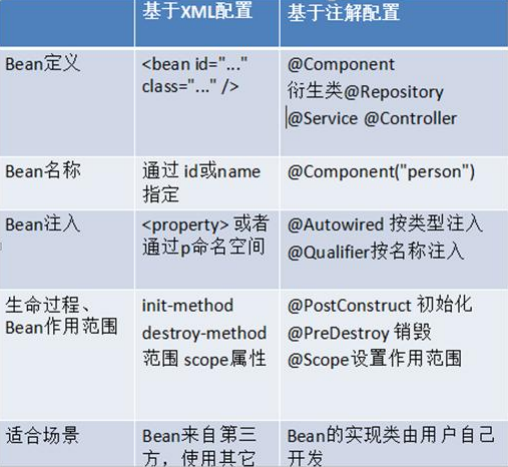

# 基于注解的 IOC 配置
> 学习基于注解的 IoC 配置，大家脑海里首先得有一个认知，即注解配置和 xml 配置要实现的功能都是一样
的，都是要降低程序间的耦合。只是配置的形式不一样。
关于实际的开发中到底使用xml还是注解，每家公司有着不同的使用习惯。所以这两种配置方式我们都需要掌
握。
我们在讲解注解配置时，采用上一章节的案例，把 spring 的 xml 配置内容改为使用注解逐步实现。
## 使用@Component 注解配置管理的资源
```
@Component("accountServiceAnno")
public class AccountServiceAnnoImpl implements IAccountService {
  private IAccountDao accountDao;

  public void setAccountDao(IAccountDao accountDao) {
    this.accountDao = accountDao;
  }

  public void saveAccount() {

    System.out.println("基于注解的 IOC 配置");
  }
}
```
>注意：基于注解整合时，导入约束时需要多导入一个 context 名称空间下的约束。
```
<beans xmlns="http://www.springframework.org/schema/beans"
       xmlns:context="http://www.springframework.org/schema/context"
       xmlns:xsi="http://www.w3.org/2001/XMLSchema-instance"
       xsi:schemaLocation="http://www.springframework.org/schema/beans
       http://www.springframework.org/schema/beans/spring-beans.xsd
                           http://www.springframework.org/schema/context
                           http://www.springframework.org/schema/context/spring-context.xsd">
    <!-- 告知 spring 创建容器时要扫描的包 -->
    <context:component-scan base-package="cn.andyoung"></context:component-scan>
</beans>
```
## 常用注解
### 用于创建对象的
- 相当于：`<bean id="" class="">`
#### @Component
- 作用：
把资源让 spring 来管理。相当于在 xml 中配置一个 bean。
- 属性：
value：指定 bean 的 id。如果不指定 value 属性，默认 bean 的 id 是当前类的类名。首字母小写。
#### @Controller @Service @Repository
>他们三个注解都是针对一个的衍生注解，他们的作用及属性都是一模一样的。
他们只不过是提供了更加明确的语义化。

- @Controller：一般用于表现层的注解。
- @Service：一般用于业务层的注解。
- @Repository：一般用于持久层的注解。
细节：如果注解中有且只有一个属性要赋值时，且名称是 value，value 在赋值是可以不写。
### 用于注入数据的
相当于：
```
<property name="" ref=""> 
<property name="" value="">
```
#### @Autowired
- 作用：
自动按照类型注入。当使用注解注入属性时，set 方法可以省略。它只能注入其他 bean 类型。当有多个类型匹配时，使用要注入的对象变量名称作为 bean 的 id，在 spring 容器查找，找到了也可以注入成功。找不到就报错。
#### @Qualifier
- 作用：
在自动按照类型注入的基础之上，再按照 Bean 的 id 注入。它在给字段注入时不能独立使用，必须和
@Autowire 一起使用；但是给方法参数注入时，可以独立使用。
- 属性：
value：指定 bean 的 id。
#### @Resource
- 作用：
直接按照 Bean 的 id 注入。它也只能注入其他 bean 类型。
- 属性：
name：指定 bean 的 id。
#### @Value
- 作用：
注入基本数据类型和 String 类型数据的
- 属性：
value：用于指定值
### 用于改变作用范围的：
相当于：```<bean id="" class="" scope="">```
#### @Scope
- 作用：指定 bean 的作用范围。
- 属性：value：指定范围的值。取值：singleton prototype request session globalsession
#### 和生命周期相关的：
相当于：```<bean id="" class="" init-method="" destroy-method="" />```
#### @PostConstruct
- 作用：
用于指定初始化方法。
#### @PreDestroy
- 作用：
用于指定销毁方法。
### 关于 Spring 注解和 XML 的选择问题
- 注解的优势：配置简单，维护方便（我们找到类，就相当于找到了对应的配置）。
- XML 的优势：修改时，不用改源码。不涉及重新编译和部署。- Spring 管理 Bean 方式的比较：


- 

## spring 管理对象细节
> 基于注解的 spring IoC 配置中，bean 对象的特点和基于 XML 配置是一模一样的。
## spring 的纯注解配置
### @Configuration
- 作用：
用于指定当前类是一个 spring 配置类，当创建容器时会从该类上加载注解。获取容器时需要使用
AnnotationApplicationContext(有@Configuration 注解的类.class)。
- 属性：
value:用于指定配置类的字节码
```
@Configurationpublic 
class SpringConfiguration {

}
```
> 我们已经把配置文件用类来代替了，但是如何配置创建容器时要扫描的包呢？
请看下一个注解。
### @ComponentScan
- 作用：
用于指定 spring 在初始化容器时要扫描的包。作用和在 spring 的 xml 配置文件中的：
`<context:component-scan base-package="com.itheima"/>`是一样的。
属性：
- basePackages：用于指定要扫描的包。和该注解中的 value 属性作用一样。
```
@Configurationpublic 
@ComponentScan("cn.andyoung")
class SpringConfiguration {

}
```
### @Bean
- 作用：
该注解只能写在方法上，表明使用此方法创建一个对象，并且放入 spring 容器。
- 属性：
name：给当前@Bean 注解方法创建的对象指定一个名称(即 bean 的 id）。
```
public class JdbcConfig {
  /** * 创建一个数据源，并存入 spring 容器中* @return */
  @Bean(name = "dataSource")
  public DataSource createDataSource() {

    return null;
  }
}
```
### @PropertySource
- 作用：
用于加载.properties 文件中的配置。例如我们配置数据源时，可以把连接数据库的信息写到properties 配置文件中，就可以使用此注解指定 properties 配置文件的位置。
- 属性：value[]：用于指定 properties 文件位置。如果是在类路径下，需要写上 classpath:
```
public class JdbcConfig {
  @Value("${jdbc.driver}")
  private String driver;

  @Value("${jdbc.url}")
  private String url;

  @Value("${jdbc.username}")
  private String username;

  @Value("${jdbc.password}")
  private String password;
}
```
### @Import
- 作用：
用于导入其他配置类，在引入其他配置类时，可以不用再写@Configuration 注解。当然，写上也没问题。
- 属性：value[]：用于指定其他配置类的字节码。
```
@Configuration
@ComponentScan(basePackages = "com.itheima.spring")
@Import({JdbcConfig.class})
public class SpringConfiguration {

}

@Configuration
@PropertySource("classpath:jdbc.properties")
public class JdbcConfig {
    
}
```

