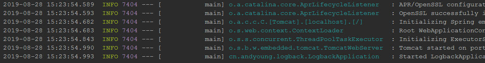

# Spring Boot的日志详解
## 日志框架的介绍
Spring Boot默认使用的是Logback这个日志框架，一般而言，使用默认的就足够了，如果读者不习惯的话，只需要更换对应框架的Starter就足够了。
### 日志格式

- 日期时间：精确到毫秒
- 日志级别：ERROR， WARN， INFO， DEBUG or TRACE
- 进程 id
- 分割符：用于区分实际的日志记录
- 线程名：括在方括号中
- 日志名字：通常是源类名
- 日志信息
## 加入依赖
```
<dependency>
    <groupId>org.springframework.boot</groupId>
    <artifactId>spring-boot-starter-logging</artifactId>
</dependency>
```
### 更改配置
- application.properties
```
server.port=8888
spring.output.ansi.enabled=always
logging.level.org.springframework.web=warn
logging.level.root=INFO
logging.path=D:/java/log
logging.file.max-size=10MB
#写入文件的格式
#logging.pattern.file=
```
- 控制台输出
日志级别从低到高分为TRACE < DEBUG < INFO < WARN < ERROR < FATAL，如果设置为WARN，则低于WARN的信息都不会输出。
Spring Boot中默认配置ERROR、WARN和INFO级别的日志输出到控制台。您还可以通过启动您的应用程序--debug标志来启用“调试”模式（开发的时候推荐开启）
- 文件输出
默认情况下，Spring Boot将日志输出到控制台，不会写到日志文件。如果要编写除控制台输出之外的日志文件，则需在application.properties中设置logging.file或logging.path属性。
  - logging.file，设置文件，可以是绝对路径，也可以是相对路径。如：logging.file=my.log
  - logging.path，设置目录，会在该目录下创建spring.log文件，并写入日志内容，如：logging.path=/var/log
如果只配置 logging.file，会在项目的当前路径下生成一个 xxx.log 日志文件。

> 如果只配置 logging.path，在 /var/log文件夹生成一个日志文件为 spring.log
注：二者不能同时使用，如若同时使用，则只有logging.file生效
默认情况下，日志文件的大小达到10MB时会切分一次，产生新的日志文件，默认级别为：ERROR、WARN、INFO
### 级别控制
所有支持的日志记录系统都可以在Spring环境中设置记录级别（例如在application.properties中）
格式为：'logging.level.* = LEVEL'
    logging.level：日志级别控制前缀，*为包名或Logger名
    LEVEL：选项TRACE, DEBUG, INFO, WARN, ERROR, FATAL, OFF
举例：
    logging.level.com.dudu=DEBUG：com.dudu包下所有class以DEBUG级别输出
    logging.level.root=WARN：root日志以WARN级别输出
## 自定义日志配置
由于日志服务一般都在ApplicationContext创建前就初始化了，它并不是必须通过Spring的配置文件控制。因此通过系统属性和传统的Spring Boot外部配置文件依然可以很好的支持日志控制和管理。
根据不同的日志系统，你可以按如下规则组织配置文件名，就能被正确加载：
  - Logback：logback-spring.xml, logback-spring.groovy, logback.xml, logback.groovy
  - Log4j：log4j-spring.properties, log4j-spring.xml, log4j.properties, log4j.xml
  - Log4j2：log4j2-spring.xml, log4j2.xml
  - JDK (Java Util Logging)：logging.properties
Spring Boot官方推荐优先使用带有-spring的文件名作为你的日志配置（如使用logback-spring.xml，而不是logback.xml），命名为logback-spring.xml的日志配置文件，spring boot可以为它添加一些spring boot特有的配置项（下面会提到）。
上面是默认的命名规则，并且放在src/main/resources下面即可。
```
logging.config=classpath:logging-config.xml
```
- 下面我们来看看一个普通的logback-spring.xml例子
```
<?xml version="1.0" encoding="UTF-8"?>
<configuration scan="true" scanPeriod="60 seconds" debug="false">
    <contextName>spring-boot-logging</contextName>
    <property name="logPath" value="log"/>

    <!--输出到控制台-->
    <appender name="console" class="ch.qos.logback.core.ConsoleAppender">
        <encoder>
            <pattern>%d{yyyy-MM-dd-HH:mm:ss} [%thread] %-5level %logger- %msg%n</pattern>
        </encoder>
    </appender>

    <!--输出到文件-->
    <appender name="file" class="ch.qos.logback.core.rolling.RollingFileAppender">
        <!--<file>${logPath}/spring-boot-logging.log</file>-->

        <rollingPolicy class="ch.qos.logback.core.rolling.TimeBasedRollingPolicy">
            <fileNamePattern>${logPath}/spring-boot-logging.%d{yyyy-MM-dd}.log.zip</fileNamePattern>
            <!-- 日志保存周期 -->
            <maxHistory>30</maxHistory>
            <!-- 总大小 -->
            <totalSizeCap>100KB</totalSizeCap>
        </rollingPolicy>
        <encoder>
            <pattern>%d{HH:mm:ss.SSS} [%thread] %-5level %logger{36} - %msg%n</pattern>
        </encoder>
    </appender>

    <root level="INFO">
        <appender-ref ref="console"/>
        <appender-ref ref="file"/>
    </root>
    <logger name="cn.andyoung.logback.controller" level="WARN">
        <appender-ref ref="console"/>
        <appender-ref ref="file"/>
    </logger>
</configuration>
```
## 根节点`<configuration>`包含的属性
- scan:当此属性设置为true时，配置文件如果发生改变，将会被重新加载，默认值为true。
- scanPeriod:设置监测配置文件是否有修改的时间间隔，如果没有给出时间单位，默认单位是毫秒。当scan为true时，此属性生效。默认的时间间隔为1分钟。
- debug:当此属性设置为true时，将打印出logback内部日志信息，实时查看logback运行状态。默认值为false。
根节点`<configuration>`的子节点：
`<configuration>`下面一共有2个属性，3个子节点，分别是：
## 属性一：设置上下文名称`<contextName>`
每个logger都关联到logger上下文，默认上下文名称为“default”。但可以使用`<contextName>`设置成其他名字，用于区分不同应用程序的记录。一旦设置，不能修改,可以通过`%contextName`来打印日志上下文名称。
`<contextName>logback</contextName>`
## 属性二：设置变量`<property>`
用来定义变量值的标签，`<property>` 有两个属性，name和value；其中name的值是变量的名称，value的值时变量定义的值。通过`<property>`定义的值会被插入到logger上下文中。定义变量后，可以使“${}”来使用变量。
`<property name="logPath" value="log"/>`
## 子节点一`<appender>`
appender用来格式化日志输出节点，有俩个属性name和class，class用来指定哪种输出策略，常用就是控制台输出策略和文件输出策略。
## 控制台输出ConsoleAppender：
```
<!--输出到控制台-->
    <appender name="console" class="ch.qos.logback.core.ConsoleAppender">
        <filter class="ch.qos.logback.classic.filter.LevelFilter">
            <level>ERROR</level>
        </filter>
        <encoder>
            <pattern>%d{yyyy-MM-dd-HH:mm:ss} [%thread] %-5level %logger- %msg%n</pattern>
        </encoder>
    </appender>
```
- `<encoder>`表示对日志进行编码：
  - %d{HH: mm:ss.SSS}——日志输出时间
  - %thread——输出日志的进程名字，这在Web应用以及异步任务处理中很有用
  - %-5level——日志级别，并且使用5个字符靠左对齐
  - %logger{36}——日志输出者的名字
  - %msg——日志消息
  - %n——平台的换行符

ThresholdFilter为系统定义的拦截器，例如我们用ThresholdFilter来过滤掉ERROR级别以下的日志不输出到文件中。如果不用记得注释掉，不然你控制台会发现没日志~
## 输出到文件RollingFileAppender
另一种常见的日志输出到文件，随着应用的运行时间越来越长，日志也会增长的越来越多，将他们输出到同一个文件并非一个好办法。RollingFileAppender用于切分文件日志：
```
<!--输出到文件-->
    <appender name="file" class="ch.qos.logback.core.rolling.RollingFileAppender">
        <file>${logPath}/spring-boot-logging.log</file>

        <rollingPolicy class="ch.qos.logback.core.rolling.TimeBasedRollingPolicy">
            <fileNamePattern>${logPath}/spring-boot-logging.%d{yyyy-MM-dd}.log</fileNamePattern>
            <!-- 日志保存周期 -->
            <maxHistory>30</maxHistory>
            <!-- 总大小 -->
            <totalSizeCap>100KB</totalSizeCap>
        </rollingPolicy>
        <encoder>
            <pattern>%d{HH:mm:ss.SSS} [%thread] %-5level %logger{36} - %msg%n</pattern>
        </encoder>
    </appender>
```
其中重要的是rollingPolicy的定义，上例中`<fileNamePattern>`logback.%d{yyyy-MM-dd}.log`</fileNamePattern>`定义了日志的切分方式——把每一天的日志归档到一个文件中，`<maxHistory>`30`</maxHistory>`表示只保留最近30天的日志，以防止日志填满整个磁盘空间。同理，可以使用%d{yyyy-MM-dd_HH-mm}来定义精确到分的日志切分方式。`<totalSizeCap>`1GB`</totalSizeCap`>用来指定日志文件的上限大小，例如设置为1GB的话，那么到了这个值，就会删除旧的日志
> 说明：当天的日志会记录在`spring-boot-logging.log`文件里。昨天的日志会被转移到`<fileNamePattern>`logback.%d{yyyy-MM-dd}.log`</fileNamePattern>`文件
## 子节点二<root>
root节点是必选节点，用来指定最基础的日志输出级别，只有一个level属性。
- level:用来设置打印级别，大小写无关：TRACE, DEBUG, INFO, WARN, ERROR, ALL 和 OFF，不能设置为INHERITED或者同义词NULL，默认是DEBUG。
`<root>`可以包含零个或多个`<appender-ref>`元素，标识这个appender将会添加到这个loger。
```
<root level="info">
    <appender-ref ref="console"/>
    <appender-ref ref="file"/>
</root>
```
## 子节点三`<loger>`
`<loger>`用来设置某一个包或者具体的某一个类的日志打印级别、以及指定`<appender>`。`<loger>`仅有一个name属性，一个可选的level和一个可选的addtivity属性。
- name:用来指定受此loger约束的某一个包或者具体的某一个类。
- level:用来设置打印级别，大小写无关：TRACE, DEBUG, INFO, WARN, ERROR, ALL 和 OFF，还有一个特俗值INHERITED或者同义词NULL，代表强制执行上级的级别。如果未设置此属性，那么当前loger将会继承上级的级别。
- addtivity:是否向上级loger传递打印信息。默认是true。
loger在实际使用的时候有两种情况，先来看一看代码中如何使用：
```
<logger name="cn.andyoung.logback.controller" level="WARN">
    <appender-ref ref="console"/>
    <appender-ref ref="file"/>
</logger>
```