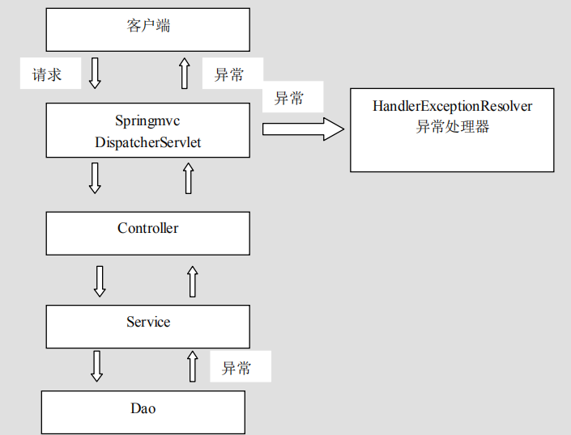

# SpringMVC 中的异常处理
## 异常处理的思路
- 系统中异常包括两类：预期异常和运行时异常 RuntimeException，前者通过捕获异常从而获取异常信息，后者主要通过规范代码开发、测试通过手段减少运行时异常的发生。
- 系统的 dao、service、controller 出现都通过 throws Exception 向上抛出，最后由 springmvc 前端控制器交由异常处理器进行异常处理，如下图：

### 编写异常类和错误页面
```
public class SycException extends Exception {
  private String message;

  public String getMessage() {
    return message;
  }

  public SycException(String message) {
    this.message = message;
  }
}
```
- jsp
```
<body>
执行失败！

${message}
</body>
```
### 自定义异常处理器
```
public class SysExceptionResolver implements HandlerExceptionResolver {
  @Override
  public ModelAndView resolveException(
      HttpServletRequest request, HttpServletResponse response, Object handler, Exception ex) {
    // 获取到异常对象
    SysException e = null;
    if (ex instanceof SysException) {
      e = (SysException) ex;
    } else {
      e = new SysException("系统正在维护....");
    }
    // 创建ModelAndView对象
    ModelAndView mv = new ModelAndView();
    mv.addObject("errorMsg", e.getMessage());
    mv.setViewName("error");
    return mv;
  }
}
```
### 配置异常处理器
```
 <!--配置自定义异常处理器-->
    <bean id="handlerExceptionResolver" class="cn.andyoung.exception.SysExceptionResolver"></bean>
```
