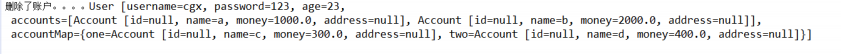

# Spring mvc 注解
## RequestMapping 注解
源码：
```
@Target({ElementType.METHOD, ElementType.TYPE})
@Retention(RetentionPolicy.RUNTIME)
@Documented
@Mapping
public @interface RequestMapping { }
```
- 作用：
用于建立请求 URL 和处理请求方法之间的对应关系。
- 出现位置：
- 类上：
请求 URL 的第一级访问目录。此处不写的话，就相当于应用的根目录。写的话需要以/开头。
它出现的目的是为了使我们的 URL 可以按照模块化管理:
  - 例如：
    - 账户模块：
<font color='red'>/account</font>/add
<font color='red'>/account</font>/update
<font color='red'>/account</font>/delete
...
    - 订单模块：
<font color='red'>/order</font>/add
<font color='red'>/order</font>/update
<font color='red'>/order</font>/delete
红色的部分就是把 RequsetMappding 写在类上，使我们的 URL 更加精细。
- 方法上：
请求 URL 的第二级访问目录。
- 属性：
  - value：用于指定请求的 URL。它和 path 属性的作用是一样的。
  - method：用于指定请求的方式。
  - params：用于指定限制请求参数的条件。它支持简单的表达式。要求请求参数的 key 和 value 必须和
配置的一模一样。
>例如：
params = {"accountName"}，表示请求参数必须有 accountName
params = {"moeny!100"}，表示请求参数中 money 不能是 100。
headers：用于指定限制请求消息头的条件。
注意：
以上四个属性只要出现 2 个或以上时，他们的关系是与的关系
## 请求参数的绑定
我们都知道，表单中请求参数都是基于 key=value 的。
SpringMVC 绑定请求参数的过程是通过把表单提交请求参数，作为控制器中方法参数进行绑定的。
例如：
`<a href="account/findAccount?accountId=10">查询账户</a>`
中请求参数是：
accountId=10
```
/**
* 查询账户
* @return
*/
@RequestMapping("/findAccount")
public String findAccount(Integer accountId) {
    System.out.println("查询了账户。。。。"+accountId);
    return "success"; 
}
```
### 支持的数据类型：
- 基本类型参数：
包括基本类型和 String 类型
- POJO 类型参数：
包括实体类，以及关联的实体类
- 数组和集合类型参数：
包括 List 结构和 Map 结构的集合（包括数组）
> SpringMVC 绑定请求参数是自动实现的，但是要想使用，必须遵循使用要求。
## 使用要求
- 如果是基本类型或者 String 类型：
要求我们的参数名称必须和控制器中方法的形参名称保持一致。(严格区分大小写)
- 如果是 POJO 类型，或者它的关联对象：
要求表单中参数名称和 POJO 类的属性名称保持一致。并且控制器方法的参数类型是 POJO 类型。
- 如果是集合类型,有两种方式：
  - 第一种：
要求集合类型的请求参数必须在 POJO 中。在表单中请求参数名称要和 POJO 中集合属性名称相同。
给 List 集合中的元素赋值，使用下标。
给 Map 集合中的元素赋值，使用键值对。
  - 第二种：
接收的请求参数是 json 格式数据。需要借助一个注解实现。
- 注意:
它还可以实现一些数据类型自动转换。内置转换器全都在：
```
org.springframework.core.convert.support 包下。有：
java.lang.Boolean -> java.lang.String : ObjectToStringConverter
java.lang.Character -> java.lang.Number : CharacterToNumberFactory
java.lang.Character -> java.lang.String : ObjectToStringConverter
java.lang.Enum -> java.lang.String : EnumToStringConverter
java.lang.Number -> java.lang.Character : NumberToCharacterConverter
java.lang.Number -> java.lang.Number : NumberToNumberConverterFactory
java.lang.Number -> java.lang.String : ObjectToStringConverter
java.lang.String -> java.lang.Boolean : StringToBooleanConverter
java.lang.String -> java.lang.Character : StringToCharacterConverter
java.lang.String -> java.lang.Enum : StringToEnumConverterFactory
java.lang.String -> java.lang.Number : StringToNumberConverterFactory
java.lang.String -> java.util.Locale : StringToLocaleConverter
java.lang.String -> java.util.Properties : StringToPropertiesConverter
java.lang.String -> java.util.UUID : StringToUUIDConverter
java.util.Locale -> java.lang.String : ObjectToStringConverter
java.util.Properties -> java.lang.String : PropertiesToStringConverter
java.util.UUID -> java.lang.String : ObjectToStringConverter
......
如遇特殊类型转换要求，需要我们自己编写自定义类型转换器。
```
### 使用示例
#### 基本类型和 String 类型作为参数
`public String findAccount(Integer accountId,String accountName)`
#### POJO 类型作为参数
```
public class Account implements Serializable {
private Integer id;
private String name;
private Float money;
private Address address;
//getters and setters
}

public class Address implements Serializable {
private String provinceName;
private String cityName;
//getters and setters
}

```
- jsp 代码：
```
<!-- pojo 类型演示 --> 
<form action="account/saveAccount" method="post">
账户名称：<input type="text" name="name" ><br/>
账户金额：<input type="text" name="money" ><br/>
账户省份：<input type="text" name="address.provinceName" ><br/>
账户城市：<input type="text" name="address.cityName" ><br/>
<input type="submit" value="保存">
</form>
```
- 控制器代码：
```
@RequestMapping("/saveAccount")
public String saveAccount(Account account) {
System.out.println("保存了账户。。。。"+account);
return "success"; 
}
```
- 运行结果：

#### POJO 类中包含集合类型参数
- jsp 代码：
```
<!-- POJO 类包含集合类型演示 --> 
<form action="account/updateAccount" method="post">
用户名称：<input type="text" name="username" ><br/>
用户密码：<input type="password" name="password" ><br/>
用户年龄：<input type="text" name="age" ><br/>
账户 1 名称：<input type="text" name="accounts[0].name" ><br/>
账户 1 金额：<input type="text" name="accounts[0].money" ><br/>
账户 2 名称：<input type="text" name="accounts[1].name" ><br/>
账户 2 金额：<input type="text" name="accounts[1].money" ><br/>
账户 3 名称：<input type="text" name="accountMap['one'].name" ><br/>
账户 3 金额：<input type="text" name="accountMap['one'].money" ><br/>
账户 4 名称：<input type="text" name="accountMap['two'].name" ><br/>
账户 4 金额：<input type="text" name="accountMap['two'].money" ><br/>
<input type="submit" value="保存">
</form>
```
- 控制器代码：
```
/**
* 更新账户
* @return
*/
@RequestMapping("/updateAccount")
public String updateAccount(User user) {
System.out.println("更新了账户。。。。"+user);
return "success"; 
}
```
- 运行结果：

#### 请求参数乱码问题
- post 请求方式：
在 web.xml 中配置一个过滤器
```
<!-- 配置 springMVC 编码过滤器 --> <filter> <filter-name>CharacterEncodingFilter</filter-name> <filter-class>
org.springframework.web.filter.CharacterEncodingFilter
</filter-class>
<!-- 设置过滤器中的属性值 --> <init-param> <param-name>encoding</param-name> <param-value>UTF-8</param-value>
</init-param>
<!-- 启动过滤器 --> <init-param> <param-name>forceEncoding</param-name> <param-value>true</param-value>
</init-param>
</filter>
<!-- 过滤所有请求 --> <filter-mapping> <filter-name>CharacterEncodingFilter</filter-name> <url-pattern>/*</url-pattern>
</filter-mapping> 在 springmvc 的配置文件中可以配置，静态资源不过滤：
<!-- location 表示路径，mapping 表示文件，**表示该目录下的文件以及子目录的文件 -->
<mvc:resources location="/css/" mapping="/css/**"/>
<mvc:resources location="/images/" mapping="/images/**"/>
<mvc:resources location="/scripts/" mapping="/javascript/**"/>
```
- get 请求方式：
```
tomacat 对 GET 和 POST 请求处理方式是不同的，GET 请求的编码问题，要改 tomcat 的 server.xml
配置文件，如下：
`<Connector connectionTimeout="20000" port="8080"
protocol="HTTP/1.1" redirectPort="8443"/>`
改为：
`<Connector connectionTimeout="20000" port="8080"
protocol="HTTP/1.1" redirectPort="8443"
useBodyEncodingForURI="true"/>`
如果遇到 ajax 请求仍然乱码，请把：
useBodyEncodingForURI="true"改为 URIEncoding="UTF-8"
即可。
```
### 自定义类型转换器
#### 使用场景
- jsp 代码：
```
<!-- 特殊情况之：类型转换问题 --> 
<a href="account/deleteAccount?date=2018-01-01">根据日期删除账户</a>
```
控制器代码：
```
@RequestMapping("/deleteAccount")
public String deleteAccount(String date) {
System.out.println("删除了账户。。。。"+date);
return "success"; 
}
```
#### 使用步骤
- 第一步：定义一个类，实现 Converter 接口，该接口有两个泛型。
```
/** 把字符串转换日期 */
public class StringToDateConverter implements Converter<String, Date> {

  /**
   * String source 传入进来字符串
   *
   * @param source
   * @return
   */
  public Date convert(String source) {
    // 判断
    if (source == null) {
      throw new RuntimeException("请您传入数据");
    }
    DateFormat df = new SimpleDateFormat("yyyy-MM-dd");

    try {
      // 把字符串转换日期
      return df.parse(source);
    } catch (Exception e) {
      throw new RuntimeException("数据类型转换出现错误");
    }
  }
}
```
- 第二步：在 spring 配置文件中配置类型转换器。
spring 配置类型转换器的机制是，将自定义的转换器注册到类型转换服务中去。
```
<!--配置自定义类型转换器-->
    <bean id="conversionService" class="org.springframework.context.support.ConversionServiceFactoryBean">
        <!-- 给工厂注入一个新的类型转换器 -->
        <property name="converters">
            <set>
                <!-- 配置自定义类型转换器 -->
                <bean class="cn.andyoung.utils.StringToDateConverter"/>
            </set>
        </property>
    </bean>
```
第三步：在 annotation-driven 标签中引用配置的类型转换服务
```
<!-- 引用自定义类型转换器 --> 
<mvc:annotation-driven conversion-service="converterService"></mvc:annotation-driven>
```
### 使用 ServletAPI 对象作为方法参数
SpringMVC 还支持使用原始 ServletAPI 对象作为控制器方法的参数。支持原始 ServletAPI 对象有：
- HttpServletRequest 
- HttpServletResponse
- HttpSession
- java.security.Principal
- Locale
- InputStream 
- OutputStream 
- Reader 
- Writer
我们可以把上述对象，直接写在控制的方法参数中使用。
```
@RequestMapping("/testServletAPI")
  public String testServletAPI(
      HttpServletRequest request, HttpServletResponse response, HttpSession session) {
    System.out.println(request);
    System.out.println(response);
    System.out.println(session);
    return "success";
  }
```
# 常用注解
## RequestParam
### 使用说明
- 作用：
把请求中指定名称的参数给控制器中的形参赋值。
- 属性：
value：请求参数中的名称。
required：请求参数中是否必须提供此参数。默认值：true。表示必须提供，如果不提供将报错。
### 使用示例
```
@RequestMapping("/useRequestParam")
  public String useRequestParam(
      @RequestParam("name") String username,
      @RequestParam(value = "age", required = false) Integer age) {
    System.out.println(username + "," + age);
    return "success";
  }
```
## RequestBody
### 使用说明
- 作用：
用于获取请求体内容。直接使用得到是 key=value&key=value...结构的数据。
get 请求方式不适用。
- 属性：
required：是否必须有请求体。默认值是:true。当取值为 true 时,get 请求方式会报错。如果取值为 false，get 请求得到是 null。
### 使用示例
```
@RequestMapping("/useRequestBody")
  public String useRequestBody(@RequestBody(required = false) String body) {
    System.out.println(body);
    return "success";
  }
```
## PathVaribale
### 使用说明
- 作用：
用于绑定 url 中的占位符。例如：请求 url 中 /delete/{id}，这个{id}就是 url 占位符。
url 支持占位符是 spring3.0 之后加入的。是 springmvc 支持 rest 风格 URL 的一个重要标志。
- 属性：
value：用于指定 url 中占位符名称。
required：是否必须提供占位符。
### 使用示例
```
@RequestMapping("/usePathVariable/{id}")
  public String usePathVariable(@PathVariable("id") Integer id) {
    System.out.println(id);
    return "success";
  }
```
### REST 风格 URL
- 什么是 rest：
REST（英文：Representational State Transfer，简称 REST）描述了一个架构样式的网络系统，比如 web 应用程序。它首次出现在 2000 年 Roy Fielding 的博士论文中，他是 HTTP 规范的主要编写者之一。在目前主流的三种 Web 服务交互方案中，REST 相比于 SOAP（Simple Object Access protocol，简单对象访问协议）以及 XML-RPC 更加简单明了，无论是对 URL 的处理还是对 Payload 的编码，REST 都倾向于用更加简单轻量的方法设计和实现。值得注意的是 REST 并没有一个明确的标准，而更像是一种设计的风格。它本身并没有什么实用性，其核心价值在于如何设计出符合 REST 风格的网络接口。
- restful 的优点
它结构清晰、符合标准、易于理解、扩展方便，所以正得到越来越多网站的采用。
- restful 的特性：
  - 资源（Resources）：网络上的一个实体，或者说是网络上的一个具体信息。
它可以是一段文本、一张图片、一首歌曲、一种服务，总之就是一个具体的存在。可以用一个 URI（统一资源定位符）指向它，每种资源对应一个特定的 URI 。要获取这个资源，访问它的 URI 就可以，因此 URI 即为每一个资源的独一无二的识别符。   - 表现层（Representation）：把资源具体呈现出来的形式，叫做它的表现层 （Representation）。比如，文本可以用 txt 格式表现，也可以用 HTML 格式、XML 格式、JSON 格式表现，甚至可以采用二进制格式。
  - 状态转化（State Transfer）：每 发出一个请求，就代表了客户端和服务器的一次交互过程。
HTTP 协议，是一个无状态协议，即所有的状态都保存在服务器端。因此，如果客户端想要操作服务器，
必须通过某种手段，让服务器端发生“状态转化”（State Transfer）。而这种转化是建立在表现层之上的，所以
就是 “表现层状态转化”。具体说，就是 HTTP 协议里面，四个表示操作方式的动词：GET 、POST 、PUT、
DELETE。它们分别对应四种基本操作：GET 用来获取资源，POST 用来新建资源，PUT 用来更新资源，DELETE 用来
删除资源。
- restful 的示例：
/account/1 HTTP GET ： 得到 id = 1 的 account 
/account/1 HTTP DELETE： 删除 id = 1 的 account 
/account/1 HTTP PUT： 更新 id = 1 的 account
/account   HTTP POST： 新增 account
### 基于 HiddentHttpMethodFilter 的示例
- 作用：
由于浏览器 form 表单只支持 GET 与 POST 请求，而 DELETE、PUT 等 method 并不支持，Spring3.0 添加了一个过滤器，可以将浏览器请求改为指定的请求方式，发送给我们的控制器方法，使得支持 GET、POST、PUT 与 DELETE 请求。
- 使用方法：
  - 第一步：在 web.xml 中配置该过滤器。
  - 第二步：请求方式必须使用 post 请求。
  - 第三步：按照要求提供_method 请求参数，该参数的取值就是我们需要的请求方式。
- jsp
```
<!-- 删除 --> <form action="springmvc/testRestDELETE/1" method="post"> <input type="hidden" name="_method" value="DELETE"> <input type="submit" value="删除">
</form> <hr/>
<!-- 查询一个 --> <form action="springmvc/testRestGET/1" method="post"> <input type="hidden" name="_method" value="GET"> <input type="submit" value="查询">
</form>
```
- 控制器中示例代码：
```
/**
* put 请求：更新
* @param username
* @return
*/
@RequestMapping(value="/testRestPUT/{id}",method=RequestMethod.PUT)
public String testRestfulURLPUT(@PathVariable("id")Integer id,User user){
System.out.println("rest put "+id+","+user);
return "success"; 
}
```
## RequestHeader
### 使用说明
- 作用：
用于获取请求消息头。
- 属性：
value：提供消息头名称
required：是否必须有此消息头
- 注：
在实际开发中一般不怎么用。
### 使用示例
```
/**
   * RequestHeader 注解
   *
   * @param user
   * @return
   */
  @RequestMapping("/useRequestHeader")
  public String useRequestHeader(
      @RequestHeader(value = "Accept-Language", required = false) String requestHeader) {
    System.out.println(requestHeader);
    return "success";
  }
```
## CookieValue
### 使用说明
- 作用：
用于把指定 cookie 名称的值传入控制器方法参数。
- 属性：
value：指定 cookie 的名称。
required：是否必须有此 cookie。
### 使用示例
```
/**
   * Cookie 注解注解
   *
   * @return
   */
  @RequestMapping("/useCookieValue")
  public String useCookieValue(
      @CookieValue(value = "JSESSIONID", required = false) String cookieValue) {
    System.out.println(cookieValue);
    return "success";
  }
```
## ModelAttribute
### 使用说明
- 作用：
该注解是 SpringMVC4.3 版本以后新加入的。它可以用于修饰方法和参数。
出现在方法上，表示当前方法会在控制器的方法执行之前，先执行。它可以修饰没有返回值的方法，也可以修饰有具体返回值的方法。
出现在参数上，获取指定的数据给参数赋值。
- 属性：
value：用于获取数据的 key。key 可以是 POJO 的属性名称，也可以是 map 结构的 key。
- 应用场景：
当表单提交数据不是完整的实体类数据时，保证没有提交数据的字段使用数据库对象原来的数据。
- 例如：
我们在编辑一个用户时，用户有一个创建信息字段，该字段的值是不允许被修改的。在提交表单数据是肯定没有此字段的内容，一旦更新会把该字段内容置为 null，此时就可以使用此注解解决问题。
### 使用示例
```
/**
   * 被 ModelAttribute 修饰的方法
   *
   * @param user
   */
  @ModelAttribute
  public void showModel(User user) {
    System.out.println("执行了 showModel 方法" + user.getUsername());
  }
  /**
   * 接收请求的方法
   *
   * @param user
   * @return
   */
  @RequestMapping("/testModelAttribute")
  public String testModelAttribute(User user) {
    System.out.println("执行了控制器的方法" + user.getUsername());
    return "success";
  }
```
#### 基于 Map 的应用场景示例 1：ModelAttribute 修饰方法带返回值
- 需求：
修改用户信息，要求用户的密码不能修改
- jsp 的代码：
```
<!-- 修改用户信息 --> 
<form action="springmvc/updateUser" method="post">
用户名称：<input type="text" name="username" ><br/>
用户年龄：<input type="text" name="age" ><br/>
<input type="submit" value="保存">
</form>
```
- 控制的代码：
```
@ModelAttribute
  public User showModel(String username) {
    // 模拟去数据库查询
    User abc = findUserByName(username);
    System.out.println("执行了 showModel 方法" + abc);
    return abc;
  }
  /**
   * 模拟修改用户方法
   *
   * @param user
   * @return
   */
  @RequestMapping("/updateUser")
  public String updateModelAttribute(User user) {
    System.out.println("控制器中处理请求的方法：修改用户：" + user);
    return "success";
  }
  /**
   * 模拟去数据库查询
   *
   * @param username
   * @return
   */
  private User findUserByName(String username) {
    User user = new User();
    user.setUsername(username);
    return user;
  }
```
#### 基于 Map 的应用场景示例 1：ModelAttribute 修饰方法不带返回值
- 需求：
修改用户信息，要求用户的密码不能修改
- jsp 中的代码：
```
<!-- 修改用户信息 --> 
<form action="springmvc/updateUser" method="post">
用户名称：<input type="text" name="username" ><br/>
用户年龄：<input type="text" name="age" ><br/>
<input type="submit" value="保存">
</form>
```
- 控制的代码：
```
/**
   * 查询数据库中用户信息
   *
   * @param user
   */
  @ModelAttribute
  public void showModel(String username, Map<String, User> map) {
    // 模拟去数据库查询
    User user = findUserByName1(username);
    System.out.println("执行了 showModel 方法" + user);
    map.put("abc", user);
  }
  /**
   * 模拟修改用户方法
   *
   * @param user
   * @return
   */
  @RequestMapping("/updateUser")
  public String testModelAttribute1(@ModelAttribute("abc") User user) {
    System.out.println("控制器中处理请求的方法：修改用户：" + user);
    return "success";
  }
  /**
   * 模拟去数据库查询
   *
   * @param username
   * @return
   */
  private User findUserByName1(String username) {
    User user = new User();
    user.setUsername(username);
    user.setAge(19);
    user.setPassword("123456");//不设置密码
    return user;
  }
```
## SessionAttribute
- 作用：
用于多次执行控制器方法间的参数共享。
- 属性：
value：用于指定存入的属性名称
type：用于指定存入的数据类型。
### 使用说明
### 使用示例
```

@Controller("session")
@SessionAttributes(
    value = {"username", "password"},
    types = {Integer.class})
public class SessionController {
  /**
   * 把数据存入 SessionAttribute
   *
   * @param model
   * @return Model 是 spring 提供的一个接口，该接口有一个实现类 ExtendedModelMap 该类继承了 ModelMap，而 ModelMap 就是
   *     LinkedHashMap 子类
   */
  @RequestMapping("/testPut")
  public String testPut(Model model) {
    model.addAttribute("username", "泰斯特");
    model.addAttribute("password", "123456");
    model.addAttribute("age", 31);
    // 跳转之前将数据保存到 username、password 和 age 中，因为注解@SessionAttribute 中有这几个参数
    return "success";
  }

  @RequestMapping("/testGet")
  public String testGet(ModelMap model) {
    System.out.println(
        model.get("username") + ";" + model.get("password") + ";" + model.get("age"));
    return "success";
  }

  @RequestMapping("/testClean")
  public String complete(SessionStatus sessionStatus) {
    sessionStatus.setComplete();
    return "success";
  }
}
```