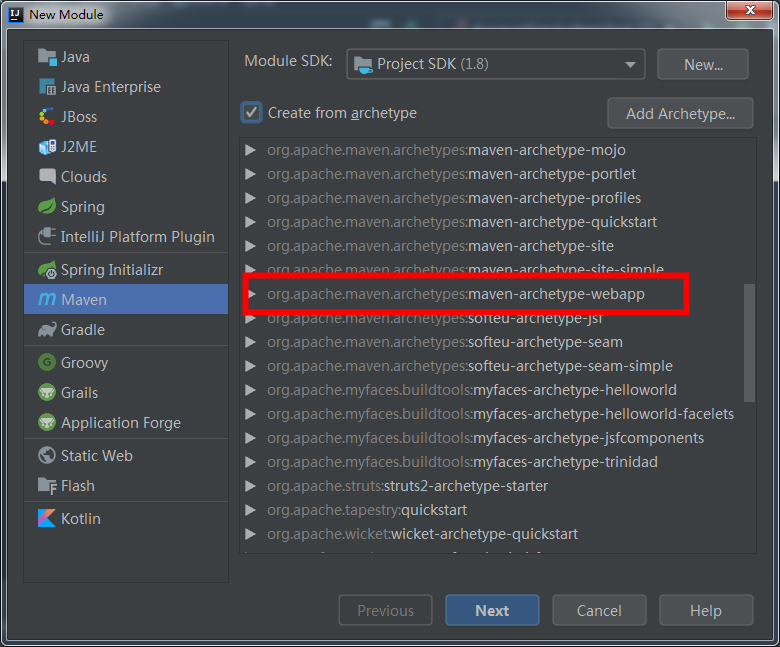
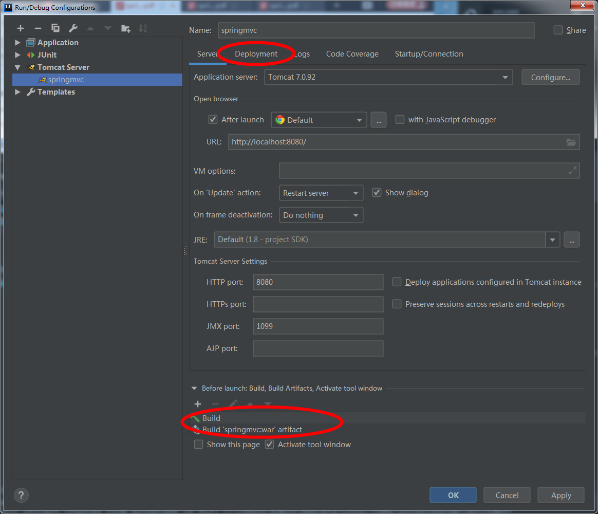
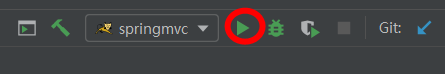
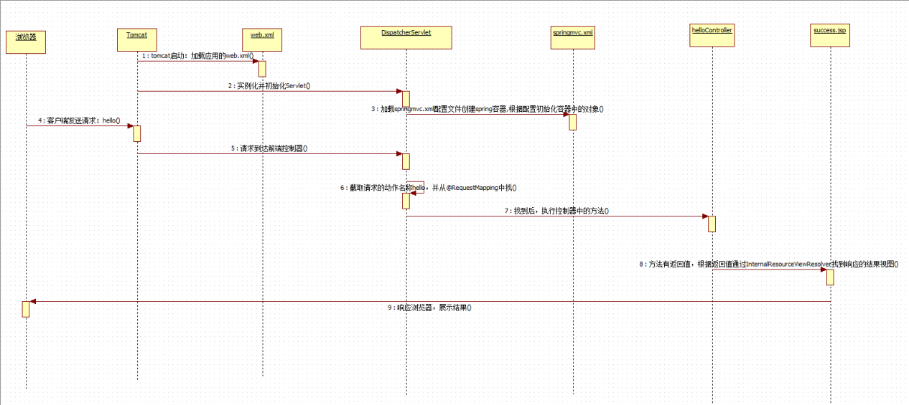
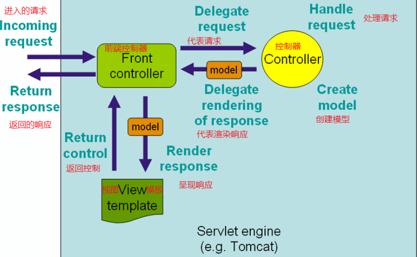

# SpringMVC
## 创建项目
### 简单的启动项目
- 选择Maven webapp


- 配置Tomcat

- run 

- pom.xml
```
<?xml version="1.0" encoding="UTF-8"?>

<project xmlns="http://maven.apache.org/POM/4.0.0" xmlns:xsi="http://www.w3.org/2001/XMLSchema-instance"
  xsi:schemaLocation="http://maven.apache.org/POM/4.0.0 http://maven.apache.org/xsd/maven-4.0.0.xsd">
  <modelVersion>4.0.0</modelVersion>

  <groupId>springmvc</groupId>
  <artifactId>springmvc</artifactId>
  <version>1.0-SNAPSHOT</version>
  <packaging>war</packaging>

  <name>springmvc Maven Webapp</name>
  <!-- FIXME change it to the project's website -->
  <url>http://www.example.com</url>

  <properties>
    <project.build.sourceEncoding>UTF-8</project.build.sourceEncoding>
    <maven.compiler.source>1.8</maven.compiler.source>
    <maven.compiler.target>1.8</maven.compiler.target>
    <spring.version>5.0.2.RELEASE</spring.version>
  </properties>

  <dependencies>
    <dependency>
      <groupId>junit</groupId>
      <artifactId>junit</artifactId>
      <version>4.11</version>
      <scope>test</scope>
    </dependency>
    <dependency>
      <groupId>org.springframework</groupId>
      <artifactId>spring-context</artifactId>
      <version>${spring.version}</version>
    </dependency>

    <dependency>
      <groupId>org.springframework</groupId>
      <artifactId>spring-web</artifactId>
      <version>${spring.version}</version>
    </dependency>

    <dependency>
      <groupId>org.springframework</groupId>
      <artifactId>spring-webmvc</artifactId>
      <version>${spring.version}</version>
    </dependency>

    <dependency>
      <groupId>javax.servlet</groupId>
      <artifactId>servlet-api</artifactId>
      <version>2.5</version>
      <scope>provided</scope>
    </dependency>

    <dependency>
      <groupId>javax.servlet.jsp</groupId>
      <artifactId>jsp-api</artifactId>
      <version>2.0</version>
      <scope>provided</scope>
    </dependency>
  </dependencies>

  <build>
    <finalName>springmvc</finalName>
    <pluginManagement><!-- lock down plugins versions to avoid using Maven defaults (may be moved to parent pom) -->
      <plugins>
        <plugin>
          <artifactId>maven-clean-plugin</artifactId>
          <version>3.1.0</version>
        </plugin>
        <!-- see http://maven.apache.org/ref/current/maven-core/default-bindings.html#Plugin_bindings_for_war_packaging -->
        <plugin>
          <artifactId>maven-resources-plugin</artifactId>
          <version>3.0.2</version>
        </plugin>
        <plugin>
          <artifactId>maven-compiler-plugin</artifactId>
          <version>3.8.0</version>
        </plugin>
        <plugin>
          <artifactId>maven-surefire-plugin</artifactId>
          <version>2.22.1</version>
        </plugin>
        <plugin>
          <artifactId>maven-war-plugin</artifactId>
          <version>3.2.2</version>
        </plugin>
        <plugin>
          <artifactId>maven-install-plugin</artifactId>
          <version>2.5.2</version>
        </plugin>
        <plugin>
          <artifactId>maven-deploy-plugin</artifactId>
          <version>2.8.2</version>
        </plugin>
      </plugins>
    </pluginManagement>
  </build>
</project>

```
### 配置web.xml
```
<!DOCTYPE web-app PUBLIC
        "-//Sun Microsystems, Inc.//DTD Web Application 2.3//EN"
        "http://java.sun.com/dtd/web-app_2_3.dtd" >

<web-app>
    <display-name>Archetype Created Web Application</display-name>
    <!-- 配置 spring mvc 的核心控制器 -->
    <servlet>
        <servlet-name>dispatcherServlet</servlet-name>
        <servlet-class>org.springframework.web.servlet.DispatcherServlet</servlet-class>
        <!-- 配置初始化参数，用于读取 SpringMVC 的配置文件 -->
        <init-param>
            <param-name>contextConfigLocation</param-name>
            <param-value>classpath:springmvc.xml</param-value>
        </init-param>
        <!-- 配置 servlet 的对象的创建时间点：应用加载时创建。
        取值只能是非 0 正整数，表示启动顺序 -->
        <load-on-startup>1</load-on-startup>
    </servlet>
    <servlet-mapping>
        <servlet-name>dispatcherServlet</servlet-name>
        <url-pattern>/</url-pattern>
    </servlet-mapping>

    <!--配置解决中文乱码的过滤器-->
    <filter>
        <filter-name>characterEncodingFilter</filter-name>
        <filter-class>org.springframework.web.filter.CharacterEncodingFilter</filter-class>
        <init-param>
            <param-name>encoding</param-name>
            <param-value>UTF-8</param-value>
        </init-param>
    </filter>
    <filter-mapping>
        <filter-name>characterEncodingFilter</filter-name>
        <url-pattern>/*</url-pattern>
    </filter-mapping>
</web-app>
```
### 配置springmvc 配置文件
```
<?xml version="1.0" encoding="UTF-8"?>
<beans xmlns="http://www.springframework.org/schema/beans"
       xmlns:mvc="http://www.springframework.org/schema/mvc"
       xmlns:context="http://www.springframework.org/schema/context"
       xmlns:xsi="http://www.w3.org/2001/XMLSchema-instance"
       xsi:schemaLocation="
        http://www.springframework.org/schema/beans
        http://www.springframework.org/schema/beans/spring-beans.xsd
        http://www.springframework.org/schema/mvc
        http://www.springframework.org/schema/mvc/spring-mvc.xsd
        http://www.springframework.org/schema/context
        http://www.springframework.org/schema/context/spring-context.xsd">

    <!-- 开启注解扫描 -->
    <context:component-scan base-package="cn.andyoung"/>

    <!-- 视图解析器对象 -->
    <bean id="internalResourceViewResolver" class="org.springframework.web.servlet.view.InternalResourceViewResolver">
        <property name="prefix" value="/WEB-INF/pages/"/>
        <property name="suffix" value=".jsp"/>
    </bean>

    <!--配置自定义类型转换器-->
    <bean id="conversionService" class="org.springframework.context.support.ConversionServiceFactoryBean">
        <property name="converters">
            <set>
                <bean class="cn.andyoung.utils.StringToDateConverter"/>
            </set>
        </property>
    </bean>


    <!-- 开启SpringMVC框架注解的支持 -->
    <mvc:annotation-driven conversion-service="conversionService"/>

</beans>
```
### 编写控制器并使用注解配置
```
@Controller("helloController")
public class HelloController {

  @RequestMapping("/hello")
  public String hello() {
    System.out.println("HELLO WORLD");
    return "success";
  }
}
```
## 执行过程及原理分析
### 执行过程

- 1、服务器启动，应用被加载。读取到 web.xml 中的配置创建 spring 容器并且初始化容器中的对象。
2、浏览器发送请求，被 DispatherServlet 捕获，该 Servlet 并不处理请求，而是把请求转发出去。转发的路径是根据请求 URL，匹配@RequestMapping 中的内容。
3、匹配到了后，执行对应方法。该方法有一个返回值。
4、根据方法的返回值，借助 InternalResourceViewResolver 找到对应的结果视图。
5、渲染结果视图，响应浏览器。
### SpringMVC的请求响应流程 

### DispatcherServlet：前端控制器
用户请求到达前端控制器，它就相当于 mvc 模式中的 c，dispatcherServlet 是整个流程控制的中心，由它调用其它组件处理用户的请求，dispatcherServlet 的存在降低了组件之间的耦合性。
### HandlerMapping：处理器映射器
HandlerMapping 负责根据用户请求找到 Handler 即处理器，SpringMVC 提供了不同的映射器实现不同的映射方式，例如：配置文件方式，实现接口方式，注解方式等。
### Handler：处理器
它就是我们开发中要编写的具体业务控制器。由 DispatcherServlet 把用户请求转发到 Handler。由Handler 对具体的用户请求进行处理。
### HandlAdapter：处理器适配器
通过 HandlerAdapter 对处理器进行执行，这是适配器模式的应用，通过扩展适配器可以对更多类型的处理
器进行执行。
### View Resolver：视图解析器
View Resolver 负责将处理结果生成 View 视图，View Resolver 首先根据逻辑视图名解析成物理视图名
即具体的页面地址，再生成 View 视图对象，最后对 View 进行渲染将处理结果通过页面展示给用户。
### View：视图
SpringMVC 框架提供了很多的 View 视图类型的支持，包括：jstlView、freemarkerView、pdfView等。我们最常用的视图就是 jsp。
一般情况下需要通过页面标签或页面模版技术将模型数据通过页面展示给用户，需要由程序员根据业务需求开发具体的页面。
### <mvc:annotation-driven>说明
- 在 SpringMVC 的各个组件中，处理器映射器、处理器适配器、视图解析器称为 SpringMVC 的三大组件。
- 使 用 ```<mvc:annotation-driven>``` 自动加载 RequestMappingHandlerMapping （处理映射器） 和
RequestMappingHandlerAdapter （ 处 理 适 配 器 ） ， 可 用 在 SpringMVC.xml 配 置 文 件 中 使 用
```<mvc:annotation-driven>```替代注解处理器和适配器的配置。
它就相当于在 xml 中配置了：
```
<!-- 上面的标签相当于 如下配置-->
<!-- Begin -->
<!-- HandlerMapping --> 
<bean class="org.springframework.web.servlet.mvc.method.annotation.RequestMappingHandlerMapping"></bean> 
<bean class="org.springframework.web.servlet.handler.BeanNameUrlHandlerMapping"></bean>
<!-- HandlerAdapter --> 
<bean class="org.springframework.web.servlet.mvc.method.annotation.RequestMappingHandlerAdapter"></bean> 
<bean class="org.springframework.web.servlet.mvc.HttpRequestHandlerAdapter"></bean> 
<bean class="org.springframework.web.servlet.mvc.SimpleControllerHandlerAdapter"></bean>
<!-- HadnlerExceptionResolvers --> 
<bean class="org.springframework.web.servlet.mvc.method.annotation.ExceptionHandlerExceptionResolver"></bean> 
<bean class="org.springframework.web.servlet.mvc.annotation.ResponseStatusExceptionResolver"></bean> 
<bean class="org.springframework.web.servlet.mvc.support.DefaultHandlerExceptionResolver"></bean>
<!-- End -->
```
注意：
一般开发中，我们都需要写上此标签（虽然从入门案例中看，我们不写也行，随着课程的深入，该标签还有具体的使用场景）。
明确：
我们只需要编写处理具体业务的控制器以及视图。